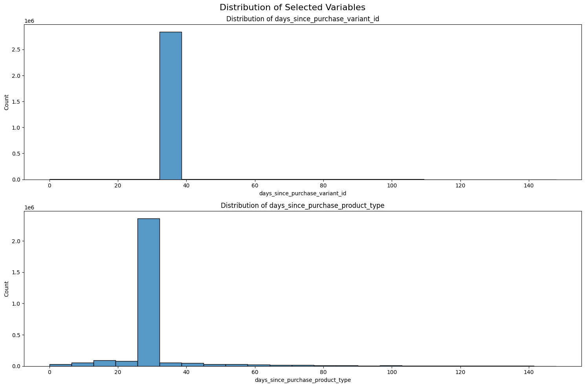
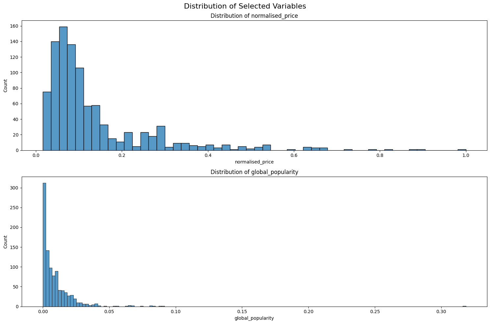
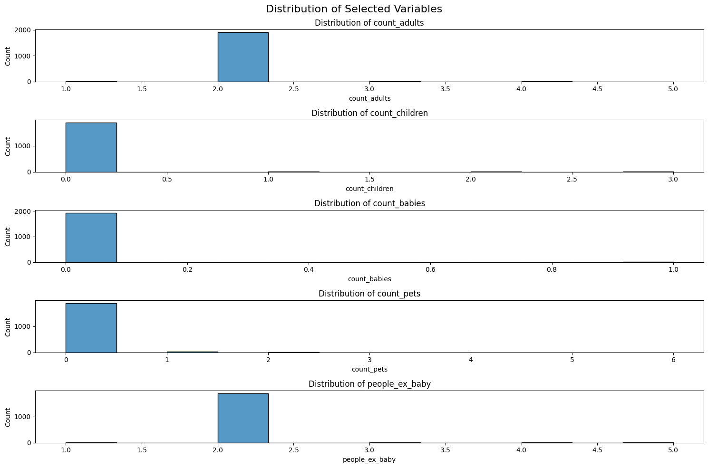
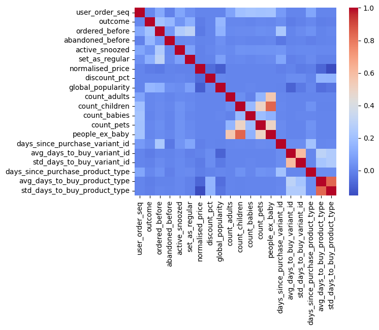

```python
from dotenv import load_dotenv
import os
import boto3
import pandas as pd
import matplotlib.pyplot as plt
import seaborn as sns

local_path = "/home/lucas/zrive-ds/data/module_2/feature_frame.csv"
```


```python
load_dotenv()
session = boto3.Session(
    aws_access_key_id=os.getenv("AWS_ACCESS_KEY_ID"),
    aws_secret_access_key=os.getenv("AWS_SECRET_ACCESS_KEY"),
)

s3 = session.client("s3")

bucket_name = "zrive-ds-data"
path = "groceries/box_builder_dataset/feature_frame.csv"


try:
    s3.download_file(bucket_name, path, local_path)
    print(f"File downloaded succesfully.")
except Exception as e:
    print(f"File not found : {e}")
```

    File downloaded succesfully.


```python
dataset = pd.read_csv(local_path)
```


```python
dataset.info()
```

    <class 'pandas.core.frame.DataFrame'>
    RangeIndex: 2880549 entries, 0 to 2880548
    Data columns (total 27 columns):
     #   Column                            Dtype  
    ---  ------                            -----  
     0   variant_id                        int64  
     1   product_type                      object 
     2   order_id                          int64  
     3   user_id                           int64  
     4   created_at                        object 
     5   order_date                        object 
     6   user_order_seq                    int64  
     7   outcome                           float64
     8   ordered_before                    float64
     9   abandoned_before                  float64
     10  active_snoozed                    float64
     11  set_as_regular                    float64
     12  normalised_price                  float64
     13  discount_pct                      float64
     14  vendor                            object 
     15  global_popularity                 float64
     16  count_adults                      float64
     17  count_children                    float64
     18  count_babies                      float64
     19  count_pets                        float64
     20  people_ex_baby                    float64
     21  days_since_purchase_variant_id    float64
     22  avg_days_to_buy_variant_id        float64
     23  std_days_to_buy_variant_id        float64
     24  days_since_purchase_product_type  float64
     25  avg_days_to_buy_product_type      float64
     26  std_days_to_buy_product_type      float64
    dtypes: float64(19), int64(4), object(4)
    memory usage: 593.4+ MB


```python
dataset.tail(15)
```


<div>
<style scoped>
    .dataframe tbody tr th:only-of-type {
        vertical-align: middle;
    }

    .dataframe tbody tr th {
        vertical-align: top;
    }

    .dataframe thead th {
        text-align: right;
    }
</style>
<table border="1" class="dataframe">
  <thead>
    <tr style="text-align: right;">
      <th></th>
      <th>variant_id</th>
      <th>product_type</th>
      <th>order_id</th>
      <th>user_id</th>
      <th>created_at</th>
      <th>order_date</th>
      <th>user_order_seq</th>
      <th>outcome</th>
      <th>ordered_before</th>
      <th>abandoned_before</th>
      <th>...</th>
      <th>count_children</th>
      <th>count_babies</th>
      <th>count_pets</th>
      <th>people_ex_baby</th>
      <th>days_since_purchase_variant_id</th>
      <th>avg_days_to_buy_variant_id</th>
      <th>std_days_to_buy_variant_id</th>
      <th>days_since_purchase_product_type</th>
      <th>avg_days_to_buy_product_type</th>
      <th>std_days_to_buy_product_type</th>
    </tr>
  </thead>
  <tbody>
    <tr>
      <th>2880534</th>
      <td>33826439594116</td>
      <td>healthcarevitamins</td>
      <td>3643179434116</td>
      <td>3778055471236</td>
      <td>2021-03-03 10:53:57</td>
      <td>2021-03-03 00:00:00</td>
      <td>4</td>
      <td>0.0</td>
      <td>0.0</td>
      <td>0.0</td>
      <td>...</td>
      <td>0.0</td>
      <td>0.0</td>
      <td>0.0</td>
      <td>2.0</td>
      <td>33.0</td>
      <td>34.0</td>
      <td>27.693045</td>
      <td>30.0</td>
      <td>34.0</td>
      <td>27.451392</td>
    </tr>
    <tr>
      <th>2880535</th>
      <td>33826439594116</td>
      <td>healthcarevitamins</td>
      <td>3643189461124</td>
      <td>3395083075716</td>
      <td>2021-03-03 11:13:32</td>
      <td>2021-03-03 00:00:00</td>
      <td>9</td>
      <td>0.0</td>
      <td>0.0</td>
      <td>0.0</td>
      <td>...</td>
      <td>0.0</td>
      <td>0.0</td>
      <td>0.0</td>
      <td>2.0</td>
      <td>33.0</td>
      <td>34.0</td>
      <td>27.693045</td>
      <td>30.0</td>
      <td>34.0</td>
      <td>27.451392</td>
    </tr>
    <tr>
      <th>2880536</th>
      <td>33826439594116</td>
      <td>healthcarevitamins</td>
      <td>3643199160452</td>
      <td>3925018706052</td>
      <td>2021-03-03 11:36:16</td>
      <td>2021-03-03 00:00:00</td>
      <td>2</td>
      <td>0.0</td>
      <td>0.0</td>
      <td>0.0</td>
      <td>...</td>
      <td>0.0</td>
      <td>0.0</td>
      <td>0.0</td>
      <td>2.0</td>
      <td>33.0</td>
      <td>34.0</td>
      <td>27.693045</td>
      <td>30.0</td>
      <td>34.0</td>
      <td>27.451392</td>
    </tr>
    <tr>
      <th>2880537</th>
      <td>33826439594116</td>
      <td>healthcarevitamins</td>
      <td>3643217739908</td>
      <td>3923447873668</td>
      <td>2021-03-03 12:14:59</td>
      <td>2021-03-03 00:00:00</td>
      <td>2</td>
      <td>0.0</td>
      <td>0.0</td>
      <td>0.0</td>
      <td>...</td>
      <td>0.0</td>
      <td>0.0</td>
      <td>0.0</td>
      <td>2.0</td>
      <td>33.0</td>
      <td>34.0</td>
      <td>27.693045</td>
      <td>30.0</td>
      <td>34.0</td>
      <td>27.451392</td>
    </tr>
    <tr>
      <th>2880538</th>
      <td>33826439594116</td>
      <td>healthcarevitamins</td>
      <td>3643226718340</td>
      <td>3929955500164</td>
      <td>2021-03-03 12:32:48</td>
      <td>2021-03-03 00:00:00</td>
      <td>3</td>
      <td>0.0</td>
      <td>0.0</td>
      <td>0.0</td>
      <td>...</td>
      <td>0.0</td>
      <td>0.0</td>
      <td>0.0</td>
      <td>2.0</td>
      <td>33.0</td>
      <td>34.0</td>
      <td>27.693045</td>
      <td>30.0</td>
      <td>34.0</td>
      <td>27.451392</td>
    </tr>
    <tr>
      <th>2880539</th>
      <td>33826439594116</td>
      <td>healthcarevitamins</td>
      <td>3643229274244</td>
      <td>3536923295876</td>
      <td>2021-03-03 12:36:28</td>
      <td>2021-03-03 00:00:00</td>
      <td>4</td>
      <td>0.0</td>
      <td>0.0</td>
      <td>0.0</td>
      <td>...</td>
      <td>0.0</td>
      <td>0.0</td>
      <td>0.0</td>
      <td>2.0</td>
      <td>33.0</td>
      <td>34.0</td>
      <td>27.693045</td>
      <td>30.0</td>
      <td>34.0</td>
      <td>27.451392</td>
    </tr>
    <tr>
      <th>2880540</th>
      <td>33826439594116</td>
      <td>healthcarevitamins</td>
      <td>3643240185988</td>
      <td>3919083962500</td>
      <td>2021-03-03 12:54:08</td>
      <td>2021-03-03 00:00:00</td>
      <td>3</td>
      <td>0.0</td>
      <td>0.0</td>
      <td>0.0</td>
      <td>...</td>
      <td>0.0</td>
      <td>0.0</td>
      <td>0.0</td>
      <td>2.0</td>
      <td>33.0</td>
      <td>34.0</td>
      <td>27.693045</td>
      <td>30.0</td>
      <td>34.0</td>
      <td>27.451392</td>
    </tr>
    <tr>
      <th>2880541</th>
      <td>33826439594116</td>
      <td>healthcarevitamins</td>
      <td>3643241300100</td>
      <td>3864791220356</td>
      <td>2021-03-03 12:56:04</td>
      <td>2021-03-03 00:00:00</td>
      <td>2</td>
      <td>0.0</td>
      <td>0.0</td>
      <td>0.0</td>
      <td>...</td>
      <td>0.0</td>
      <td>0.0</td>
      <td>0.0</td>
      <td>2.0</td>
      <td>33.0</td>
      <td>34.0</td>
      <td>27.693045</td>
      <td>30.0</td>
      <td>34.0</td>
      <td>27.451392</td>
    </tr>
    <tr>
      <th>2880542</th>
      <td>33826439594116</td>
      <td>healthcarevitamins</td>
      <td>3643247394948</td>
      <td>3908686545028</td>
      <td>2021-03-03 13:06:52</td>
      <td>2021-03-03 00:00:00</td>
      <td>2</td>
      <td>0.0</td>
      <td>0.0</td>
      <td>0.0</td>
      <td>...</td>
      <td>0.0</td>
      <td>0.0</td>
      <td>0.0</td>
      <td>2.0</td>
      <td>33.0</td>
      <td>34.0</td>
      <td>27.693045</td>
      <td>30.0</td>
      <td>34.0</td>
      <td>27.451392</td>
    </tr>
    <tr>
      <th>2880543</th>
      <td>33826439594116</td>
      <td>healthcarevitamins</td>
      <td>3643252899972</td>
      <td>5029635227780</td>
      <td>2021-03-03 13:15:57</td>
      <td>2021-03-03 00:00:00</td>
      <td>2</td>
      <td>0.0</td>
      <td>0.0</td>
      <td>0.0</td>
      <td>...</td>
      <td>0.0</td>
      <td>0.0</td>
      <td>0.0</td>
      <td>2.0</td>
      <td>33.0</td>
      <td>34.0</td>
      <td>27.693045</td>
      <td>30.0</td>
      <td>34.0</td>
      <td>27.451392</td>
    </tr>
    <tr>
      <th>2880544</th>
      <td>33826439594116</td>
      <td>healthcarevitamins</td>
      <td>3643254800516</td>
      <td>3893722808452</td>
      <td>2021-03-03 13:19:28</td>
      <td>2021-03-03 00:00:00</td>
      <td>3</td>
      <td>0.0</td>
      <td>0.0</td>
      <td>0.0</td>
      <td>...</td>
      <td>0.0</td>
      <td>0.0</td>
      <td>0.0</td>
      <td>2.0</td>
      <td>33.0</td>
      <td>34.0</td>
      <td>27.693045</td>
      <td>30.0</td>
      <td>34.0</td>
      <td>27.451392</td>
    </tr>
    <tr>
      <th>2880545</th>
      <td>33826439594116</td>
      <td>healthcarevitamins</td>
      <td>3643274788996</td>
      <td>3883757174916</td>
      <td>2021-03-03 13:57:35</td>
      <td>2021-03-03 00:00:00</td>
      <td>4</td>
      <td>0.0</td>
      <td>0.0</td>
      <td>0.0</td>
      <td>...</td>
      <td>0.0</td>
      <td>0.0</td>
      <td>0.0</td>
      <td>2.0</td>
      <td>33.0</td>
      <td>34.0</td>
      <td>27.693045</td>
      <td>30.0</td>
      <td>34.0</td>
      <td>27.451392</td>
    </tr>
    <tr>
      <th>2880546</th>
      <td>33826439594116</td>
      <td>healthcarevitamins</td>
      <td>3643283734660</td>
      <td>3874925314180</td>
      <td>2021-03-03 14:14:24</td>
      <td>2021-03-03 00:00:00</td>
      <td>7</td>
      <td>0.0</td>
      <td>0.0</td>
      <td>0.0</td>
      <td>...</td>
      <td>0.0</td>
      <td>0.0</td>
      <td>0.0</td>
      <td>2.0</td>
      <td>33.0</td>
      <td>34.0</td>
      <td>27.693045</td>
      <td>30.0</td>
      <td>34.0</td>
      <td>27.451392</td>
    </tr>
    <tr>
      <th>2880547</th>
      <td>33826439594116</td>
      <td>healthcarevitamins</td>
      <td>3643294515332</td>
      <td>3906490826884</td>
      <td>2021-03-03 14:30:30</td>
      <td>2021-03-03 00:00:00</td>
      <td>2</td>
      <td>0.0</td>
      <td>0.0</td>
      <td>0.0</td>
      <td>...</td>
      <td>0.0</td>
      <td>0.0</td>
      <td>0.0</td>
      <td>2.0</td>
      <td>33.0</td>
      <td>34.0</td>
      <td>27.693045</td>
      <td>30.0</td>
      <td>34.0</td>
      <td>27.451392</td>
    </tr>
    <tr>
      <th>2880548</th>
      <td>33826439594116</td>
      <td>healthcarevitamins</td>
      <td>3643301986436</td>
      <td>3914253959300</td>
      <td>2021-03-03 14:42:05</td>
      <td>2021-03-03 00:00:00</td>
      <td>3</td>
      <td>0.0</td>
      <td>0.0</td>
      <td>0.0</td>
      <td>...</td>
      <td>0.0</td>
      <td>0.0</td>
      <td>0.0</td>
      <td>2.0</td>
      <td>33.0</td>
      <td>34.0</td>
      <td>27.693045</td>
      <td>30.0</td>
      <td>34.0</td>
      <td>27.451392</td>
    </tr>
  </tbody>
</table>
<p>15 rows × 27 columns</p>
</div>


```python
missing_values = dataset.isnull().sum()
print(missing_values)
```

    variant_id                          0
    product_type                        0
    order_id                            0
    user_id                             0
    created_at                          0
    order_date                          0
    user_order_seq                      0
    outcome                             0
    ordered_before                      0
    abandoned_before                    0
    active_snoozed                      0
    set_as_regular                      0
    normalised_price                    0
    discount_pct                        0
    vendor                              0
    global_popularity                   0
    count_adults                        0
    count_children                      0
    count_babies                        0
    count_pets                          0
    people_ex_baby                      0
    days_since_purchase_variant_id      0
    avg_days_to_buy_variant_id          0
    std_days_to_buy_variant_id          0
    days_since_purchase_product_type    0
    avg_days_to_buy_product_type        0
    std_days_to_buy_product_type        0
    dtype: int64


```python
dataset.describe()
```


<div>
<style scoped>
    .dataframe tbody tr th:only-of-type {
        vertical-align: middle;
    }

    .dataframe tbody tr th {
        vertical-align: top;
    }

    .dataframe thead th {
        text-align: right;
    }
</style>
<table border="1" class="dataframe">
  <thead>
    <tr style="text-align: right;">
      <th></th>
      <th>variant_id</th>
      <th>order_id</th>
      <th>user_id</th>
      <th>user_order_seq</th>
      <th>outcome</th>
      <th>ordered_before</th>
      <th>abandoned_before</th>
      <th>active_snoozed</th>
      <th>set_as_regular</th>
      <th>normalised_price</th>
      <th>...</th>
      <th>count_children</th>
      <th>count_babies</th>
      <th>count_pets</th>
      <th>people_ex_baby</th>
      <th>days_since_purchase_variant_id</th>
      <th>avg_days_to_buy_variant_id</th>
      <th>std_days_to_buy_variant_id</th>
      <th>days_since_purchase_product_type</th>
      <th>avg_days_to_buy_product_type</th>
      <th>std_days_to_buy_product_type</th>
    </tr>
  </thead>
  <tbody>
    <tr>
      <th>count</th>
      <td>2.880549e+06</td>
      <td>2.880549e+06</td>
      <td>2.880549e+06</td>
      <td>2.880549e+06</td>
      <td>2.880549e+06</td>
      <td>2.880549e+06</td>
      <td>2.880549e+06</td>
      <td>2.880549e+06</td>
      <td>2.880549e+06</td>
      <td>2.880549e+06</td>
      <td>...</td>
      <td>2.880549e+06</td>
      <td>2.880549e+06</td>
      <td>2.880549e+06</td>
      <td>2.880549e+06</td>
      <td>2.880549e+06</td>
      <td>2.880549e+06</td>
      <td>2.880549e+06</td>
      <td>2.880549e+06</td>
      <td>2.880549e+06</td>
      <td>2.880549e+06</td>
    </tr>
    <tr>
      <th>mean</th>
      <td>3.401250e+13</td>
      <td>2.978388e+12</td>
      <td>3.750025e+12</td>
      <td>3.289342e+00</td>
      <td>1.153669e-02</td>
      <td>2.113868e-02</td>
      <td>6.092589e-04</td>
      <td>2.290188e-03</td>
      <td>3.629864e-03</td>
      <td>1.272808e-01</td>
      <td>...</td>
      <td>5.492182e-02</td>
      <td>3.538562e-03</td>
      <td>5.134091e-02</td>
      <td>2.072549e+00</td>
      <td>3.312961e+01</td>
      <td>3.523734e+01</td>
      <td>2.645304e+01</td>
      <td>3.143513e+01</td>
      <td>3.088810e+01</td>
      <td>2.594969e+01</td>
    </tr>
    <tr>
      <th>std</th>
      <td>2.786246e+11</td>
      <td>2.446292e+11</td>
      <td>1.775710e+11</td>
      <td>2.140176e+00</td>
      <td>1.067876e-01</td>
      <td>1.438466e-01</td>
      <td>2.467565e-02</td>
      <td>4.780109e-02</td>
      <td>6.013891e-02</td>
      <td>1.268378e-01</td>
      <td>...</td>
      <td>3.276586e-01</td>
      <td>5.938048e-02</td>
      <td>3.013646e-01</td>
      <td>3.943659e-01</td>
      <td>3.707162e+00</td>
      <td>1.057766e+01</td>
      <td>7.168323e+00</td>
      <td>1.227511e+01</td>
      <td>4.330262e+00</td>
      <td>3.278860e+00</td>
    </tr>
    <tr>
      <th>min</th>
      <td>3.361529e+13</td>
      <td>2.807986e+12</td>
      <td>3.046041e+12</td>
      <td>2.000000e+00</td>
      <td>0.000000e+00</td>
      <td>0.000000e+00</td>
      <td>0.000000e+00</td>
      <td>0.000000e+00</td>
      <td>0.000000e+00</td>
      <td>1.599349e-02</td>
      <td>...</td>
      <td>0.000000e+00</td>
      <td>0.000000e+00</td>
      <td>0.000000e+00</td>
      <td>1.000000e+00</td>
      <td>0.000000e+00</td>
      <td>0.000000e+00</td>
      <td>1.414214e+00</td>
      <td>0.000000e+00</td>
      <td>7.000000e+00</td>
      <td>2.828427e+00</td>
    </tr>
    <tr>
      <th>25%</th>
      <td>3.380354e+13</td>
      <td>2.875152e+12</td>
      <td>3.745901e+12</td>
      <td>2.000000e+00</td>
      <td>0.000000e+00</td>
      <td>0.000000e+00</td>
      <td>0.000000e+00</td>
      <td>0.000000e+00</td>
      <td>0.000000e+00</td>
      <td>5.394416e-02</td>
      <td>...</td>
      <td>0.000000e+00</td>
      <td>0.000000e+00</td>
      <td>0.000000e+00</td>
      <td>2.000000e+00</td>
      <td>3.300000e+01</td>
      <td>3.000000e+01</td>
      <td>2.319372e+01</td>
      <td>3.000000e+01</td>
      <td>2.800000e+01</td>
      <td>2.427618e+01</td>
    </tr>
    <tr>
      <th>50%</th>
      <td>3.397325e+13</td>
      <td>2.902856e+12</td>
      <td>3.812775e+12</td>
      <td>3.000000e+00</td>
      <td>0.000000e+00</td>
      <td>0.000000e+00</td>
      <td>0.000000e+00</td>
      <td>0.000000e+00</td>
      <td>0.000000e+00</td>
      <td>8.105178e-02</td>
      <td>...</td>
      <td>0.000000e+00</td>
      <td>0.000000e+00</td>
      <td>0.000000e+00</td>
      <td>2.000000e+00</td>
      <td>3.300000e+01</td>
      <td>3.400000e+01</td>
      <td>2.769305e+01</td>
      <td>3.000000e+01</td>
      <td>3.100000e+01</td>
      <td>2.608188e+01</td>
    </tr>
    <tr>
      <th>75%</th>
      <td>3.428495e+13</td>
      <td>2.922034e+12</td>
      <td>3.874925e+12</td>
      <td>4.000000e+00</td>
      <td>0.000000e+00</td>
      <td>0.000000e+00</td>
      <td>0.000000e+00</td>
      <td>0.000000e+00</td>
      <td>0.000000e+00</td>
      <td>1.352670e-01</td>
      <td>...</td>
      <td>0.000000e+00</td>
      <td>0.000000e+00</td>
      <td>0.000000e+00</td>
      <td>2.000000e+00</td>
      <td>3.300000e+01</td>
      <td>4.000000e+01</td>
      <td>3.059484e+01</td>
      <td>3.000000e+01</td>
      <td>3.400000e+01</td>
      <td>2.796118e+01</td>
    </tr>
    <tr>
      <th>max</th>
      <td>3.454300e+13</td>
      <td>3.643302e+12</td>
      <td>5.029635e+12</td>
      <td>2.100000e+01</td>
      <td>1.000000e+00</td>
      <td>1.000000e+00</td>
      <td>1.000000e+00</td>
      <td>1.000000e+00</td>
      <td>1.000000e+00</td>
      <td>1.000000e+00</td>
      <td>...</td>
      <td>3.000000e+00</td>
      <td>1.000000e+00</td>
      <td>6.000000e+00</td>
      <td>5.000000e+00</td>
      <td>1.480000e+02</td>
      <td>8.400000e+01</td>
      <td>5.868986e+01</td>
      <td>1.480000e+02</td>
      <td>3.950000e+01</td>
      <td>3.564191e+01</td>
    </tr>
  </tbody>
</table>
<p>8 rows × 23 columns</p>
</div>


```python
selected_columns = [ 'days_since_purchase_variant_id', 'days_since_purchase_product_type']

fig, axes = plt.subplots(len(selected_columns), figsize=(15, 10))
fig.suptitle('Distribution of Selected Variables', size=16)

axes = axes.ravel()

for idx, col in enumerate(selected_columns):
    sns.histplot(data=dataset, x=col, ax=axes[idx])
    axes[idx].set_title(f'Distribution of {col}')
    axes[idx].set_xlabel(col)

plt.tight_layout()
plt.show()
```


    

    


```python
orders = dataset[dataset['outcome'] == 1]
orders.head(20)
```


<div>
<style scoped>
    .dataframe tbody tr th:only-of-type {
        vertical-align: middle;
    }

    .dataframe tbody tr th {
        vertical-align: top;
    }

    .dataframe thead th {
        text-align: right;
    }
</style>
<table border="1" class="dataframe">
  <thead>
    <tr style="text-align: right;">
      <th></th>
      <th>variant_id</th>
      <th>product_type</th>
      <th>order_id</th>
      <th>user_id</th>
      <th>created_at</th>
      <th>order_date</th>
      <th>user_order_seq</th>
      <th>outcome</th>
      <th>ordered_before</th>
      <th>abandoned_before</th>
      <th>...</th>
      <th>count_children</th>
      <th>count_babies</th>
      <th>count_pets</th>
      <th>people_ex_baby</th>
      <th>days_since_purchase_variant_id</th>
      <th>avg_days_to_buy_variant_id</th>
      <th>std_days_to_buy_variant_id</th>
      <th>days_since_purchase_product_type</th>
      <th>avg_days_to_buy_product_type</th>
      <th>std_days_to_buy_product_type</th>
    </tr>
  </thead>
  <tbody>
    <tr>
      <th>24</th>
      <td>33826472919172</td>
      <td>ricepastapulses</td>
      <td>2811116486788</td>
      <td>3463900528772</td>
      <td>2020-10-08 09:31:35</td>
      <td>2020-10-08 00:00:00</td>
      <td>5</td>
      <td>1.0</td>
      <td>0.0</td>
      <td>0.0</td>
      <td>...</td>
      <td>0.0</td>
      <td>0.0</td>
      <td>0.0</td>
      <td>2.0</td>
      <td>33.0</td>
      <td>42.0</td>
      <td>31.134053</td>
      <td>30.0</td>
      <td>30.0</td>
      <td>24.27618</td>
    </tr>
    <tr>
      <th>78</th>
      <td>33826472919172</td>
      <td>ricepastapulses</td>
      <td>2816464388228</td>
      <td>3781503156356</td>
      <td>2020-10-14 15:28:26</td>
      <td>2020-10-14 00:00:00</td>
      <td>2</td>
      <td>1.0</td>
      <td>0.0</td>
      <td>0.0</td>
      <td>...</td>
      <td>0.0</td>
      <td>0.0</td>
      <td>0.0</td>
      <td>2.0</td>
      <td>33.0</td>
      <td>42.0</td>
      <td>31.134053</td>
      <td>5.0</td>
      <td>30.0</td>
      <td>24.27618</td>
    </tr>
    <tr>
      <th>142</th>
      <td>33826472919172</td>
      <td>ricepastapulses</td>
      <td>2821889785988</td>
      <td>3787000283268</td>
      <td>2020-10-21 17:25:02</td>
      <td>2020-10-21 00:00:00</td>
      <td>2</td>
      <td>1.0</td>
      <td>0.0</td>
      <td>0.0</td>
      <td>...</td>
      <td>0.0</td>
      <td>0.0</td>
      <td>0.0</td>
      <td>2.0</td>
      <td>33.0</td>
      <td>42.0</td>
      <td>31.134053</td>
      <td>30.0</td>
      <td>30.0</td>
      <td>24.27618</td>
    </tr>
    <tr>
      <th>218</th>
      <td>33826472919172</td>
      <td>ricepastapulses</td>
      <td>2827451138180</td>
      <td>3519639879812</td>
      <td>2020-10-29 11:24:52</td>
      <td>2020-10-29 00:00:00</td>
      <td>3</td>
      <td>1.0</td>
      <td>0.0</td>
      <td>0.0</td>
      <td>...</td>
      <td>0.0</td>
      <td>0.0</td>
      <td>0.0</td>
      <td>2.0</td>
      <td>33.0</td>
      <td>42.0</td>
      <td>31.134053</td>
      <td>30.0</td>
      <td>30.0</td>
      <td>24.27618</td>
    </tr>
    <tr>
      <th>239</th>
      <td>33826472919172</td>
      <td>ricepastapulses</td>
      <td>2828980060292</td>
      <td>3788931465348</td>
      <td>2020-10-31 13:08:30</td>
      <td>2020-10-31 00:00:00</td>
      <td>3</td>
      <td>1.0</td>
      <td>0.0</td>
      <td>0.0</td>
      <td>...</td>
      <td>0.0</td>
      <td>0.0</td>
      <td>0.0</td>
      <td>2.0</td>
      <td>33.0</td>
      <td>42.0</td>
      <td>31.134053</td>
      <td>10.0</td>
      <td>30.0</td>
      <td>24.27618</td>
    </tr>
    <tr>
      <th>386</th>
      <td>33826472919172</td>
      <td>ricepastapulses</td>
      <td>2835968655492</td>
      <td>3291428749444</td>
      <td>2020-11-10 17:32:17</td>
      <td>2020-11-10 00:00:00</td>
      <td>8</td>
      <td>1.0</td>
      <td>1.0</td>
      <td>0.0</td>
      <td>...</td>
      <td>1.0</td>
      <td>0.0</td>
      <td>1.0</td>
      <td>3.0</td>
      <td>33.0</td>
      <td>42.0</td>
      <td>31.134053</td>
      <td>29.0</td>
      <td>30.0</td>
      <td>24.27618</td>
    </tr>
    <tr>
      <th>420</th>
      <td>33826472919172</td>
      <td>ricepastapulses</td>
      <td>2837177991300</td>
      <td>3763104120964</td>
      <td>2020-11-12 10:20:03</td>
      <td>2020-11-12 00:00:00</td>
      <td>2</td>
      <td>1.0</td>
      <td>0.0</td>
      <td>0.0</td>
      <td>...</td>
      <td>0.0</td>
      <td>0.0</td>
      <td>0.0</td>
      <td>2.0</td>
      <td>33.0</td>
      <td>42.0</td>
      <td>31.134053</td>
      <td>30.0</td>
      <td>30.0</td>
      <td>24.27618</td>
    </tr>
    <tr>
      <th>525</th>
      <td>33826472919172</td>
      <td>ricepastapulses</td>
      <td>2843934425220</td>
      <td>3768262721668</td>
      <td>2020-11-18 23:36:23</td>
      <td>2020-11-18 00:00:00</td>
      <td>3</td>
      <td>1.0</td>
      <td>0.0</td>
      <td>0.0</td>
      <td>...</td>
      <td>0.0</td>
      <td>0.0</td>
      <td>0.0</td>
      <td>2.0</td>
      <td>33.0</td>
      <td>42.0</td>
      <td>31.134053</td>
      <td>29.0</td>
      <td>30.0</td>
      <td>24.27618</td>
    </tr>
    <tr>
      <th>559</th>
      <td>33826472919172</td>
      <td>ricepastapulses</td>
      <td>2846287102084</td>
      <td>3813032591492</td>
      <td>2020-11-21 08:12:21</td>
      <td>2020-11-21 00:00:00</td>
      <td>2</td>
      <td>1.0</td>
      <td>0.0</td>
      <td>1.0</td>
      <td>...</td>
      <td>0.0</td>
      <td>0.0</td>
      <td>0.0</td>
      <td>2.0</td>
      <td>33.0</td>
      <td>42.0</td>
      <td>31.134053</td>
      <td>18.0</td>
      <td>30.0</td>
      <td>24.27618</td>
    </tr>
    <tr>
      <th>744</th>
      <td>33826472919172</td>
      <td>ricepastapulses</td>
      <td>2862966407300</td>
      <td>3436860375172</td>
      <td>2020-12-04 15:33:31</td>
      <td>2020-12-04 00:00:00</td>
      <td>6</td>
      <td>1.0</td>
      <td>0.0</td>
      <td>0.0</td>
      <td>...</td>
      <td>0.0</td>
      <td>0.0</td>
      <td>0.0</td>
      <td>2.0</td>
      <td>33.0</td>
      <td>42.0</td>
      <td>31.134053</td>
      <td>30.0</td>
      <td>30.0</td>
      <td>24.27618</td>
    </tr>
    <tr>
      <th>814</th>
      <td>33826472919172</td>
      <td>ricepastapulses</td>
      <td>2867010502788</td>
      <td>3828408680580</td>
      <td>2020-12-08 18:45:54</td>
      <td>2020-12-08 00:00:00</td>
      <td>3</td>
      <td>1.0</td>
      <td>1.0</td>
      <td>0.0</td>
      <td>...</td>
      <td>0.0</td>
      <td>0.0</td>
      <td>0.0</td>
      <td>2.0</td>
      <td>15.0</td>
      <td>42.0</td>
      <td>31.134053</td>
      <td>15.0</td>
      <td>30.0</td>
      <td>24.27618</td>
    </tr>
    <tr>
      <th>900</th>
      <td>33826472919172</td>
      <td>ricepastapulses</td>
      <td>2871725359236</td>
      <td>3422042521732</td>
      <td>2020-12-13 13:23:42</td>
      <td>2020-12-13 00:00:00</td>
      <td>7</td>
      <td>1.0</td>
      <td>1.0</td>
      <td>0.0</td>
      <td>...</td>
      <td>0.0</td>
      <td>0.0</td>
      <td>0.0</td>
      <td>2.0</td>
      <td>33.0</td>
      <td>42.0</td>
      <td>31.134053</td>
      <td>60.0</td>
      <td>30.0</td>
      <td>24.27618</td>
    </tr>
    <tr>
      <th>1000</th>
      <td>33826472919172</td>
      <td>ricepastapulses</td>
      <td>2875686486148</td>
      <td>3480154898564</td>
      <td>2020-12-17 13:34:55</td>
      <td>2020-12-17 00:00:00</td>
      <td>4</td>
      <td>1.0</td>
      <td>0.0</td>
      <td>0.0</td>
      <td>...</td>
      <td>0.0</td>
      <td>0.0</td>
      <td>0.0</td>
      <td>2.0</td>
      <td>33.0</td>
      <td>42.0</td>
      <td>31.134053</td>
      <td>30.0</td>
      <td>30.0</td>
      <td>24.27618</td>
    </tr>
    <tr>
      <th>1065</th>
      <td>33826472919172</td>
      <td>ricepastapulses</td>
      <td>2879127191684</td>
      <td>3811967303812</td>
      <td>2020-12-20 22:41:36</td>
      <td>2020-12-20 00:00:00</td>
      <td>2</td>
      <td>1.0</td>
      <td>1.0</td>
      <td>0.0</td>
      <td>...</td>
      <td>0.0</td>
      <td>0.0</td>
      <td>0.0</td>
      <td>2.0</td>
      <td>49.0</td>
      <td>42.0</td>
      <td>31.134053</td>
      <td>49.0</td>
      <td>30.0</td>
      <td>24.27618</td>
    </tr>
    <tr>
      <th>1176</th>
      <td>33826472919172</td>
      <td>ricepastapulses</td>
      <td>2884543774852</td>
      <td>3471802302596</td>
      <td>2020-12-29 17:00:08</td>
      <td>2020-12-29 00:00:00</td>
      <td>5</td>
      <td>1.0</td>
      <td>0.0</td>
      <td>0.0</td>
      <td>...</td>
      <td>0.0</td>
      <td>0.0</td>
      <td>0.0</td>
      <td>2.0</td>
      <td>33.0</td>
      <td>42.0</td>
      <td>31.134053</td>
      <td>48.0</td>
      <td>30.0</td>
      <td>24.27618</td>
    </tr>
    <tr>
      <th>1212</th>
      <td>33826472919172</td>
      <td>ricepastapulses</td>
      <td>2885598281860</td>
      <td>3825692967044</td>
      <td>2020-12-31 12:17:11</td>
      <td>2020-12-31 00:00:00</td>
      <td>2</td>
      <td>1.0</td>
      <td>0.0</td>
      <td>0.0</td>
      <td>...</td>
      <td>0.0</td>
      <td>0.0</td>
      <td>0.0</td>
      <td>2.0</td>
      <td>33.0</td>
      <td>42.0</td>
      <td>31.134053</td>
      <td>30.0</td>
      <td>30.0</td>
      <td>24.27618</td>
    </tr>
    <tr>
      <th>1290</th>
      <td>33826472919172</td>
      <td>ricepastapulses</td>
      <td>2887957512324</td>
      <td>3784132296836</td>
      <td>2021-01-04 12:25:03</td>
      <td>2021-01-04 00:00:00</td>
      <td>3</td>
      <td>1.0</td>
      <td>0.0</td>
      <td>0.0</td>
      <td>...</td>
      <td>0.0</td>
      <td>0.0</td>
      <td>0.0</td>
      <td>2.0</td>
      <td>33.0</td>
      <td>42.0</td>
      <td>31.134053</td>
      <td>30.0</td>
      <td>30.0</td>
      <td>24.27618</td>
    </tr>
    <tr>
      <th>1332</th>
      <td>33826472919172</td>
      <td>ricepastapulses</td>
      <td>2888321269892</td>
      <td>3766780592260</td>
      <td>2021-01-04 22:29:52</td>
      <td>2021-01-04 00:00:00</td>
      <td>2</td>
      <td>1.0</td>
      <td>0.0</td>
      <td>0.0</td>
      <td>...</td>
      <td>0.0</td>
      <td>0.0</td>
      <td>0.0</td>
      <td>2.0</td>
      <td>33.0</td>
      <td>42.0</td>
      <td>31.134053</td>
      <td>30.0</td>
      <td>30.0</td>
      <td>24.27618</td>
    </tr>
    <tr>
      <th>1367</th>
      <td>33826472919172</td>
      <td>ricepastapulses</td>
      <td>2888940552324</td>
      <td>3815142785156</td>
      <td>2021-01-05 17:33:14</td>
      <td>2021-01-05 00:00:00</td>
      <td>2</td>
      <td>1.0</td>
      <td>1.0</td>
      <td>0.0</td>
      <td>...</td>
      <td>0.0</td>
      <td>0.0</td>
      <td>0.0</td>
      <td>2.0</td>
      <td>61.0</td>
      <td>42.0</td>
      <td>31.134053</td>
      <td>61.0</td>
      <td>30.0</td>
      <td>24.27618</td>
    </tr>
    <tr>
      <th>1530</th>
      <td>33826472919172</td>
      <td>ricepastapulses</td>
      <td>2894178254980</td>
      <td>3875322626180</td>
      <td>2021-01-10 22:46:51</td>
      <td>2021-01-10 00:00:00</td>
      <td>2</td>
      <td>1.0</td>
      <td>0.0</td>
      <td>0.0</td>
      <td>...</td>
      <td>0.0</td>
      <td>0.0</td>
      <td>0.0</td>
      <td>2.0</td>
      <td>33.0</td>
      <td>42.0</td>
      <td>31.134053</td>
      <td>9.0</td>
      <td>30.0</td>
      <td>24.27618</td>
    </tr>
  </tbody>
</table>
<p>20 rows × 27 columns</p>
</div>


```python
most_recently_bought_products = dataset.sort_values('created_at').groupby('variant_id').last().reset_index()
most_recently_bought_products.head(20)
```


<div>
<style scoped>
    .dataframe tbody tr th:only-of-type {
        vertical-align: middle;
    }

    .dataframe tbody tr th {
        vertical-align: top;
    }

    .dataframe thead th {
        text-align: right;
    }
</style>
<table border="1" class="dataframe">
  <thead>
    <tr style="text-align: right;">
      <th></th>
      <th>variant_id</th>
      <th>product_type</th>
      <th>order_id</th>
      <th>user_id</th>
      <th>created_at</th>
      <th>order_date</th>
      <th>user_order_seq</th>
      <th>outcome</th>
      <th>ordered_before</th>
      <th>abandoned_before</th>
      <th>...</th>
      <th>count_children</th>
      <th>count_babies</th>
      <th>count_pets</th>
      <th>people_ex_baby</th>
      <th>days_since_purchase_variant_id</th>
      <th>avg_days_to_buy_variant_id</th>
      <th>std_days_to_buy_variant_id</th>
      <th>days_since_purchase_product_type</th>
      <th>avg_days_to_buy_product_type</th>
      <th>std_days_to_buy_product_type</th>
    </tr>
  </thead>
  <tbody>
    <tr>
      <th>0</th>
      <td>33615294398596</td>
      <td>dogfood</td>
      <td>3643301986436</td>
      <td>3914253959300</td>
      <td>2021-03-03 14:42:05</td>
      <td>2021-03-03 00:00:00</td>
      <td>3</td>
      <td>0.0</td>
      <td>0.0</td>
      <td>0.0</td>
      <td>...</td>
      <td>0.0</td>
      <td>0.0</td>
      <td>0.0</td>
      <td>2.0</td>
      <td>33.0</td>
      <td>30.0</td>
      <td>22.185593</td>
      <td>30.0</td>
      <td>24.0</td>
      <td>26.048133</td>
    </tr>
    <tr>
      <th>1</th>
      <td>33667172466820</td>
      <td>foodstorage</td>
      <td>3643301986436</td>
      <td>3914253959300</td>
      <td>2021-03-03 14:42:05</td>
      <td>2021-03-03 00:00:00</td>
      <td>3</td>
      <td>0.0</td>
      <td>0.0</td>
      <td>0.0</td>
      <td>...</td>
      <td>0.0</td>
      <td>0.0</td>
      <td>0.0</td>
      <td>2.0</td>
      <td>33.0</td>
      <td>34.0</td>
      <td>27.693045</td>
      <td>30.0</td>
      <td>37.5</td>
      <td>30.498356</td>
    </tr>
    <tr>
      <th>2</th>
      <td>33667174301828</td>
      <td>allpurposecleaner</td>
      <td>3643301986436</td>
      <td>3914253959300</td>
      <td>2021-03-03 14:42:05</td>
      <td>2021-03-03 00:00:00</td>
      <td>3</td>
      <td>0.0</td>
      <td>0.0</td>
      <td>0.0</td>
      <td>...</td>
      <td>0.0</td>
      <td>0.0</td>
      <td>0.0</td>
      <td>2.0</td>
      <td>33.0</td>
      <td>34.5</td>
      <td>30.546493</td>
      <td>30.0</td>
      <td>36.0</td>
      <td>28.268085</td>
    </tr>
    <tr>
      <th>3</th>
      <td>33667174334596</td>
      <td>handsoapsanitisers</td>
      <td>3643301986436</td>
      <td>3914253959300</td>
      <td>2021-03-03 14:42:05</td>
      <td>2021-03-03 00:00:00</td>
      <td>3</td>
      <td>0.0</td>
      <td>0.0</td>
      <td>0.0</td>
      <td>...</td>
      <td>0.0</td>
      <td>0.0</td>
      <td>0.0</td>
      <td>2.0</td>
      <td>33.0</td>
      <td>45.0</td>
      <td>34.062316</td>
      <td>30.0</td>
      <td>33.0</td>
      <td>27.961179</td>
    </tr>
    <tr>
      <th>4</th>
      <td>33667174465668</td>
      <td>handsoapsanitisers</td>
      <td>3643301986436</td>
      <td>3914253959300</td>
      <td>2021-03-03 14:42:05</td>
      <td>2021-03-03 00:00:00</td>
      <td>3</td>
      <td>0.0</td>
      <td>0.0</td>
      <td>0.0</td>
      <td>...</td>
      <td>0.0</td>
      <td>0.0</td>
      <td>0.0</td>
      <td>2.0</td>
      <td>33.0</td>
      <td>27.0</td>
      <td>28.996643</td>
      <td>30.0</td>
      <td>33.0</td>
      <td>27.961179</td>
    </tr>
    <tr>
      <th>5</th>
      <td>33667174498436</td>
      <td>handsoapsanitisers</td>
      <td>3643301986436</td>
      <td>3914253959300</td>
      <td>2021-03-03 14:42:05</td>
      <td>2021-03-03 00:00:00</td>
      <td>3</td>
      <td>0.0</td>
      <td>0.0</td>
      <td>0.0</td>
      <td>...</td>
      <td>0.0</td>
      <td>0.0</td>
      <td>0.0</td>
      <td>2.0</td>
      <td>33.0</td>
      <td>36.0</td>
      <td>23.924380</td>
      <td>30.0</td>
      <td>33.0</td>
      <td>27.961179</td>
    </tr>
    <tr>
      <th>6</th>
      <td>33667174695044</td>
      <td>bathroomlimescalecleaner</td>
      <td>3643301986436</td>
      <td>3914253959300</td>
      <td>2021-03-03 14:42:05</td>
      <td>2021-03-03 00:00:00</td>
      <td>3</td>
      <td>0.0</td>
      <td>0.0</td>
      <td>0.0</td>
      <td>...</td>
      <td>0.0</td>
      <td>0.0</td>
      <td>0.0</td>
      <td>2.0</td>
      <td>33.0</td>
      <td>32.0</td>
      <td>27.644594</td>
      <td>30.0</td>
      <td>33.0</td>
      <td>26.873475</td>
    </tr>
    <tr>
      <th>7</th>
      <td>33667174891652</td>
      <td>petcare</td>
      <td>3643301986436</td>
      <td>3914253959300</td>
      <td>2021-03-03 14:42:05</td>
      <td>2021-03-03 00:00:00</td>
      <td>3</td>
      <td>0.0</td>
      <td>0.0</td>
      <td>0.0</td>
      <td>...</td>
      <td>0.0</td>
      <td>0.0</td>
      <td>0.0</td>
      <td>2.0</td>
      <td>33.0</td>
      <td>31.5</td>
      <td>28.354156</td>
      <td>30.0</td>
      <td>31.5</td>
      <td>28.354156</td>
    </tr>
    <tr>
      <th>8</th>
      <td>33667182035076</td>
      <td>shavinggrooming</td>
      <td>3643301986436</td>
      <td>3914253959300</td>
      <td>2021-03-03 14:42:05</td>
      <td>2021-03-03 00:00:00</td>
      <td>3</td>
      <td>0.0</td>
      <td>0.0</td>
      <td>0.0</td>
      <td>...</td>
      <td>0.0</td>
      <td>0.0</td>
      <td>0.0</td>
      <td>2.0</td>
      <td>33.0</td>
      <td>41.0</td>
      <td>18.536001</td>
      <td>30.0</td>
      <td>35.0</td>
      <td>27.143111</td>
    </tr>
    <tr>
      <th>9</th>
      <td>33667182133380</td>
      <td>shavinggrooming</td>
      <td>3643301986436</td>
      <td>3914253959300</td>
      <td>2021-03-03 14:42:05</td>
      <td>2021-03-03 00:00:00</td>
      <td>3</td>
      <td>0.0</td>
      <td>0.0</td>
      <td>0.0</td>
      <td>...</td>
      <td>0.0</td>
      <td>0.0</td>
      <td>0.0</td>
      <td>2.0</td>
      <td>33.0</td>
      <td>34.0</td>
      <td>27.693045</td>
      <td>30.0</td>
      <td>35.0</td>
      <td>27.143111</td>
    </tr>
    <tr>
      <th>10</th>
      <td>33667182166148</td>
      <td>facialskincare</td>
      <td>3643301986436</td>
      <td>3914253959300</td>
      <td>2021-03-03 14:42:05</td>
      <td>2021-03-03 00:00:00</td>
      <td>3</td>
      <td>0.0</td>
      <td>0.0</td>
      <td>0.0</td>
      <td>...</td>
      <td>0.0</td>
      <td>0.0</td>
      <td>0.0</td>
      <td>2.0</td>
      <td>33.0</td>
      <td>29.0</td>
      <td>15.500538</td>
      <td>30.0</td>
      <td>38.0</td>
      <td>28.492200</td>
    </tr>
    <tr>
      <th>11</th>
      <td>33667182231684</td>
      <td>facialskincare</td>
      <td>3643301986436</td>
      <td>3914253959300</td>
      <td>2021-03-03 14:42:05</td>
      <td>2021-03-03 00:00:00</td>
      <td>3</td>
      <td>0.0</td>
      <td>0.0</td>
      <td>0.0</td>
      <td>...</td>
      <td>0.0</td>
      <td>0.0</td>
      <td>0.0</td>
      <td>2.0</td>
      <td>33.0</td>
      <td>62.5</td>
      <td>25.204016</td>
      <td>30.0</td>
      <td>38.0</td>
      <td>28.492200</td>
    </tr>
    <tr>
      <th>12</th>
      <td>33667182329988</td>
      <td>facialskincare</td>
      <td>3643301986436</td>
      <td>3914253959300</td>
      <td>2021-03-03 14:42:05</td>
      <td>2021-03-03 00:00:00</td>
      <td>3</td>
      <td>0.0</td>
      <td>0.0</td>
      <td>0.0</td>
      <td>...</td>
      <td>0.0</td>
      <td>0.0</td>
      <td>0.0</td>
      <td>2.0</td>
      <td>33.0</td>
      <td>28.0</td>
      <td>27.693045</td>
      <td>30.0</td>
      <td>38.0</td>
      <td>28.492200</td>
    </tr>
    <tr>
      <th>13</th>
      <td>33667182395524</td>
      <td>facialskincare</td>
      <td>3643301986436</td>
      <td>3914253959300</td>
      <td>2021-03-03 14:42:05</td>
      <td>2021-03-03 00:00:00</td>
      <td>3</td>
      <td>0.0</td>
      <td>0.0</td>
      <td>0.0</td>
      <td>...</td>
      <td>0.0</td>
      <td>0.0</td>
      <td>0.0</td>
      <td>2.0</td>
      <td>33.0</td>
      <td>50.5</td>
      <td>20.513410</td>
      <td>30.0</td>
      <td>38.0</td>
      <td>28.492200</td>
    </tr>
    <tr>
      <th>14</th>
      <td>33667182493828</td>
      <td>facialskincare</td>
      <td>3643301986436</td>
      <td>3914253959300</td>
      <td>2021-03-03 14:42:05</td>
      <td>2021-03-03 00:00:00</td>
      <td>3</td>
      <td>0.0</td>
      <td>0.0</td>
      <td>0.0</td>
      <td>...</td>
      <td>0.0</td>
      <td>0.0</td>
      <td>0.0</td>
      <td>2.0</td>
      <td>33.0</td>
      <td>61.0</td>
      <td>19.628241</td>
      <td>30.0</td>
      <td>38.0</td>
      <td>28.492200</td>
    </tr>
    <tr>
      <th>15</th>
      <td>33667184492676</td>
      <td>juicesquash</td>
      <td>3643301986436</td>
      <td>3914253959300</td>
      <td>2021-03-03 14:42:05</td>
      <td>2021-03-03 00:00:00</td>
      <td>3</td>
      <td>0.0</td>
      <td>0.0</td>
      <td>0.0</td>
      <td>...</td>
      <td>0.0</td>
      <td>0.0</td>
      <td>0.0</td>
      <td>2.0</td>
      <td>33.0</td>
      <td>64.0</td>
      <td>28.198095</td>
      <td>30.0</td>
      <td>27.0</td>
      <td>25.876853</td>
    </tr>
    <tr>
      <th>16</th>
      <td>33667184722052</td>
      <td>babytoiletries</td>
      <td>3643301986436</td>
      <td>3914253959300</td>
      <td>2021-03-03 14:42:05</td>
      <td>2021-03-03 00:00:00</td>
      <td>3</td>
      <td>0.0</td>
      <td>0.0</td>
      <td>0.0</td>
      <td>...</td>
      <td>0.0</td>
      <td>0.0</td>
      <td>0.0</td>
      <td>2.0</td>
      <td>33.0</td>
      <td>18.5</td>
      <td>16.067566</td>
      <td>30.0</td>
      <td>36.0</td>
      <td>29.372186</td>
    </tr>
    <tr>
      <th>17</th>
      <td>33667185016964</td>
      <td>babytoiletries</td>
      <td>3643301986436</td>
      <td>3914253959300</td>
      <td>2021-03-03 14:42:05</td>
      <td>2021-03-03 00:00:00</td>
      <td>3</td>
      <td>0.0</td>
      <td>0.0</td>
      <td>0.0</td>
      <td>...</td>
      <td>0.0</td>
      <td>0.0</td>
      <td>0.0</td>
      <td>2.0</td>
      <td>33.0</td>
      <td>37.0</td>
      <td>20.293677</td>
      <td>30.0</td>
      <td>36.0</td>
      <td>29.372186</td>
    </tr>
    <tr>
      <th>18</th>
      <td>33667185279108</td>
      <td>bathroomlimescalecleaner</td>
      <td>3643301986436</td>
      <td>3914253959300</td>
      <td>2021-03-03 14:42:05</td>
      <td>2021-03-03 00:00:00</td>
      <td>3</td>
      <td>0.0</td>
      <td>0.0</td>
      <td>0.0</td>
      <td>...</td>
      <td>0.0</td>
      <td>0.0</td>
      <td>0.0</td>
      <td>2.0</td>
      <td>33.0</td>
      <td>35.0</td>
      <td>26.821477</td>
      <td>30.0</td>
      <td>33.0</td>
      <td>26.873475</td>
    </tr>
    <tr>
      <th>19</th>
      <td>33667185311876</td>
      <td>bathroomlimescalecleaner</td>
      <td>3643301986436</td>
      <td>3914253959300</td>
      <td>2021-03-03 14:42:05</td>
      <td>2021-03-03 00:00:00</td>
      <td>3</td>
      <td>0.0</td>
      <td>0.0</td>
      <td>0.0</td>
      <td>...</td>
      <td>0.0</td>
      <td>0.0</td>
      <td>0.0</td>
      <td>2.0</td>
      <td>33.0</td>
      <td>33.0</td>
      <td>31.423412</td>
      <td>30.0</td>
      <td>33.0</td>
      <td>26.873475</td>
    </tr>
  </tbody>
</table>
<p>20 rows × 27 columns</p>
</div>


```python
selected_columns = [ 'normalised_price', 'global_popularity']

fig, axes = plt.subplots(2, figsize=(15, 10))
fig.suptitle('Distribution of Selected Variables', size=16)

axes = axes.ravel()

for idx, col in enumerate(selected_columns):
    sns.histplot(data=most_recently_bought_products, x=col, ax=axes[idx])
    axes[idx].set_title(f'Distribution of {col}')
    axes[idx].set_xlabel(col)

plt.tight_layout()
plt.show()

print("\nDescriptive statistics for selected variables:")
print(most_recently_bought_products[selected_columns].describe())
```


    

    


    
    Descriptive statistics for selected variables:
           normalised_price  global_popularity
    count        976.000000         976.000000
    mean           0.133563           0.009387
    std            0.130708           0.015211
    min            0.015993           0.000000
    25%            0.053944           0.001429
    50%            0.085118           0.005000
    75%            0.148821           0.012857
    max            1.000000           0.318571


```python
unique_recent_users = dataset.sort_values('created_at').groupby('user_id').last().reset_index()
unique_recent_users.head(20)
```


<div>
<style scoped>
    .dataframe tbody tr th:only-of-type {
        vertical-align: middle;
    }

    .dataframe tbody tr th {
        vertical-align: top;
    }

    .dataframe thead th {
        text-align: right;
    }
</style>
<table border="1" class="dataframe">
  <thead>
    <tr style="text-align: right;">
      <th></th>
      <th>user_id</th>
      <th>variant_id</th>
      <th>product_type</th>
      <th>order_id</th>
      <th>created_at</th>
      <th>order_date</th>
      <th>user_order_seq</th>
      <th>outcome</th>
      <th>ordered_before</th>
      <th>abandoned_before</th>
      <th>...</th>
      <th>count_children</th>
      <th>count_babies</th>
      <th>count_pets</th>
      <th>people_ex_baby</th>
      <th>days_since_purchase_variant_id</th>
      <th>avg_days_to_buy_variant_id</th>
      <th>std_days_to_buy_variant_id</th>
      <th>days_since_purchase_product_type</th>
      <th>avg_days_to_buy_product_type</th>
      <th>std_days_to_buy_product_type</th>
    </tr>
  </thead>
  <tbody>
    <tr>
      <th>0</th>
      <td>3046041190532</td>
      <td>33826427207812</td>
      <td>tinspackagedfoods</td>
      <td>2889875882116</td>
      <td>2021-01-06 19:34:36</td>
      <td>2021-01-06 00:00:00</td>
      <td>2</td>
      <td>0.0</td>
      <td>0.0</td>
      <td>0.0</td>
      <td>...</td>
      <td>0.0</td>
      <td>0.0</td>
      <td>0.0</td>
      <td>2.0</td>
      <td>33.0</td>
      <td>36.0</td>
      <td>31.031362</td>
      <td>30.0</td>
      <td>27.0</td>
      <td>23.827826</td>
    </tr>
    <tr>
      <th>1</th>
      <td>3218344935556</td>
      <td>34368926744708</td>
      <td>cookingsaucesmarinades</td>
      <td>2926542815364</td>
      <td>2021-02-20 15:00:16</td>
      <td>2021-02-20 00:00:00</td>
      <td>13</td>
      <td>0.0</td>
      <td>0.0</td>
      <td>0.0</td>
      <td>...</td>
      <td>0.0</td>
      <td>0.0</td>
      <td>0.0</td>
      <td>2.0</td>
      <td>33.0</td>
      <td>31.0</td>
      <td>23.675321</td>
      <td>30.0</td>
      <td>31.0</td>
      <td>25.535369</td>
    </tr>
    <tr>
      <th>2</th>
      <td>3223115595908</td>
      <td>33826448015492</td>
      <td>kidssnacks</td>
      <td>3639006953604</td>
      <td>2021-02-25 17:51:30</td>
      <td>2021-02-25 00:00:00</td>
      <td>16</td>
      <td>0.0</td>
      <td>0.0</td>
      <td>0.0</td>
      <td>...</td>
      <td>0.0</td>
      <td>0.0</td>
      <td>0.0</td>
      <td>2.0</td>
      <td>33.0</td>
      <td>20.0</td>
      <td>11.782681</td>
      <td>30.0</td>
      <td>26.5</td>
      <td>22.394709</td>
    </tr>
    <tr>
      <th>3</th>
      <td>3223197450372</td>
      <td>34173018210436</td>
      <td>dishwasherdetergent</td>
      <td>2911165022340</td>
      <td>2021-02-01 16:09:14</td>
      <td>2021-02-01 00:00:00</td>
      <td>5</td>
      <td>1.0</td>
      <td>0.0</td>
      <td>0.0</td>
      <td>...</td>
      <td>0.0</td>
      <td>0.0</td>
      <td>0.0</td>
      <td>2.0</td>
      <td>33.0</td>
      <td>40.0</td>
      <td>29.572325</td>
      <td>30.0</td>
      <td>32.0</td>
      <td>25.841947</td>
    </tr>
    <tr>
      <th>4</th>
      <td>3241962176644</td>
      <td>34371968532612</td>
      <td>babyfood6months</td>
      <td>2920908685444</td>
      <td>2021-02-13 09:48:50</td>
      <td>2021-02-13 00:00:00</td>
      <td>16</td>
      <td>0.0</td>
      <td>0.0</td>
      <td>0.0</td>
      <td>...</td>
      <td>0.0</td>
      <td>0.0</td>
      <td>0.0</td>
      <td>2.0</td>
      <td>33.0</td>
      <td>32.0</td>
      <td>14.761436</td>
      <td>30.0</td>
      <td>30.0</td>
      <td>18.973072</td>
    </tr>
    <tr>
      <th>5</th>
      <td>3291324416132</td>
      <td>33667247341700</td>
      <td>windowglasscleaner</td>
      <td>2835547914372</td>
      <td>2020-11-10 00:29:46</td>
      <td>2020-11-10 00:00:00</td>
      <td>2</td>
      <td>0.0</td>
      <td>0.0</td>
      <td>0.0</td>
      <td>...</td>
      <td>0.0</td>
      <td>0.0</td>
      <td>0.0</td>
      <td>2.0</td>
      <td>33.0</td>
      <td>39.0</td>
      <td>28.767695</td>
      <td>30.0</td>
      <td>34.5</td>
      <td>29.497704</td>
    </tr>
    <tr>
      <th>6</th>
      <td>3291330379908</td>
      <td>33667207233668</td>
      <td>bathroomlimescalecleaner</td>
      <td>2928325755012</td>
      <td>2021-02-22 23:18:51</td>
      <td>2021-02-22 00:00:00</td>
      <td>2</td>
      <td>0.0</td>
      <td>0.0</td>
      <td>0.0</td>
      <td>...</td>
      <td>0.0</td>
      <td>0.0</td>
      <td>0.0</td>
      <td>1.0</td>
      <td>33.0</td>
      <td>43.0</td>
      <td>30.171354</td>
      <td>30.0</td>
      <td>33.0</td>
      <td>26.873475</td>
    </tr>
    <tr>
      <th>7</th>
      <td>3291363377284</td>
      <td>33973246492804</td>
      <td>catfood</td>
      <td>2824618639492</td>
      <td>2020-10-25 15:55:18</td>
      <td>2020-10-25 00:00:00</td>
      <td>3</td>
      <td>0.0</td>
      <td>0.0</td>
      <td>0.0</td>
      <td>...</td>
      <td>0.0</td>
      <td>0.0</td>
      <td>0.0</td>
      <td>2.0</td>
      <td>33.0</td>
      <td>30.5</td>
      <td>31.423848</td>
      <td>30.0</td>
      <td>27.0</td>
      <td>27.212938</td>
    </tr>
    <tr>
      <th>8</th>
      <td>3291406598276</td>
      <td>34081589035140</td>
      <td>babyfood6months</td>
      <td>2862721269892</td>
      <td>2020-12-04 09:28:48</td>
      <td>2020-12-04 00:00:00</td>
      <td>2</td>
      <td>0.0</td>
      <td>0.0</td>
      <td>0.0</td>
      <td>...</td>
      <td>0.0</td>
      <td>0.0</td>
      <td>0.0</td>
      <td>2.0</td>
      <td>33.0</td>
      <td>38.0</td>
      <td>18.792096</td>
      <td>30.0</td>
      <td>30.0</td>
      <td>18.973072</td>
    </tr>
    <tr>
      <th>9</th>
      <td>3291425144964</td>
      <td>33667226566788</td>
      <td>kidsdental</td>
      <td>2913575436420</td>
      <td>2021-02-04 11:18:00</td>
      <td>2021-02-04 00:00:00</td>
      <td>6</td>
      <td>0.0</td>
      <td>0.0</td>
      <td>0.0</td>
      <td>...</td>
      <td>0.0</td>
      <td>0.0</td>
      <td>0.0</td>
      <td>2.0</td>
      <td>33.0</td>
      <td>29.0</td>
      <td>56.216842</td>
      <td>30.0</td>
      <td>29.0</td>
      <td>29.824487</td>
    </tr>
    <tr>
      <th>10</th>
      <td>3291428749444</td>
      <td>34436055105668</td>
      <td>condimentsdressings</td>
      <td>2924828164228</td>
      <td>2021-02-18 13:33:50</td>
      <td>2021-02-18 00:00:00</td>
      <td>13</td>
      <td>0.0</td>
      <td>0.0</td>
      <td>0.0</td>
      <td>...</td>
      <td>1.0</td>
      <td>0.0</td>
      <td>1.0</td>
      <td>3.0</td>
      <td>33.0</td>
      <td>30.0</td>
      <td>18.310609</td>
      <td>99.0</td>
      <td>30.0</td>
      <td>26.081884</td>
    </tr>
    <tr>
      <th>11</th>
      <td>3291454374020</td>
      <td>33667241083012</td>
      <td>bathshowergel</td>
      <td>3641727221892</td>
      <td>2021-03-01 11:53:30</td>
      <td>2021-03-01 00:00:00</td>
      <td>5</td>
      <td>0.0</td>
      <td>0.0</td>
      <td>0.0</td>
      <td>...</td>
      <td>0.0</td>
      <td>0.0</td>
      <td>0.0</td>
      <td>2.0</td>
      <td>33.0</td>
      <td>29.0</td>
      <td>21.461006</td>
      <td>30.0</td>
      <td>37.0</td>
      <td>30.506129</td>
    </tr>
    <tr>
      <th>12</th>
      <td>3291568603268</td>
      <td>33826414231684</td>
      <td>condimentsdressings</td>
      <td>2816402129028</td>
      <td>2020-10-14 13:34:20</td>
      <td>2020-10-14 00:00:00</td>
      <td>2</td>
      <td>0.0</td>
      <td>0.0</td>
      <td>0.0</td>
      <td>...</td>
      <td>0.0</td>
      <td>0.0</td>
      <td>0.0</td>
      <td>2.0</td>
      <td>33.0</td>
      <td>37.0</td>
      <td>30.115330</td>
      <td>30.0</td>
      <td>30.0</td>
      <td>26.081884</td>
    </tr>
    <tr>
      <th>13</th>
      <td>3291655995524</td>
      <td>34221708574852</td>
      <td>floorcleanerpolish</td>
      <td>2822741852292</td>
      <td>2020-10-22 13:30:52</td>
      <td>2020-10-22 00:00:00</td>
      <td>4</td>
      <td>0.0</td>
      <td>0.0</td>
      <td>0.0</td>
      <td>...</td>
      <td>0.0</td>
      <td>0.0</td>
      <td>0.0</td>
      <td>2.0</td>
      <td>33.0</td>
      <td>45.5</td>
      <td>29.265216</td>
      <td>30.0</td>
      <td>38.5</td>
      <td>31.832738</td>
    </tr>
    <tr>
      <th>14</th>
      <td>3291664810116</td>
      <td>33667196420228</td>
      <td>cleaningaccessories</td>
      <td>2824774549636</td>
      <td>2020-10-25 19:09:11</td>
      <td>2020-10-25 00:00:00</td>
      <td>2</td>
      <td>0.0</td>
      <td>0.0</td>
      <td>0.0</td>
      <td>...</td>
      <td>0.0</td>
      <td>0.0</td>
      <td>0.0</td>
      <td>2.0</td>
      <td>33.0</td>
      <td>32.0</td>
      <td>30.380568</td>
      <td>30.0</td>
      <td>35.0</td>
      <td>29.001400</td>
    </tr>
    <tr>
      <th>15</th>
      <td>3291707965572</td>
      <td>34457368068228</td>
      <td>homebaking</td>
      <td>2927742517380</td>
      <td>2021-02-22 09:48:26</td>
      <td>2021-02-22 00:00:00</td>
      <td>15</td>
      <td>0.0</td>
      <td>0.0</td>
      <td>0.0</td>
      <td>...</td>
      <td>2.0</td>
      <td>0.0</td>
      <td>1.0</td>
      <td>4.0</td>
      <td>33.0</td>
      <td>29.0</td>
      <td>14.637047</td>
      <td>54.0</td>
      <td>28.5</td>
      <td>23.710730</td>
    </tr>
    <tr>
      <th>16</th>
      <td>3291876458628</td>
      <td>33803538006148</td>
      <td>dental</td>
      <td>3638425026692</td>
      <td>2021-02-24 22:16:15</td>
      <td>2021-02-24 00:00:00</td>
      <td>3</td>
      <td>0.0</td>
      <td>0.0</td>
      <td>0.0</td>
      <td>...</td>
      <td>2.0</td>
      <td>0.0</td>
      <td>1.0</td>
      <td>4.0</td>
      <td>33.0</td>
      <td>27.0</td>
      <td>20.297602</td>
      <td>30.0</td>
      <td>33.0</td>
      <td>27.935275</td>
    </tr>
    <tr>
      <th>17</th>
      <td>3292589064324</td>
      <td>33977922191492</td>
      <td>tinspackagedfoods</td>
      <td>2824475672708</td>
      <td>2020-10-25 11:27:38</td>
      <td>2020-10-25 00:00:00</td>
      <td>3</td>
      <td>0.0</td>
      <td>0.0</td>
      <td>0.0</td>
      <td>...</td>
      <td>0.0</td>
      <td>0.0</td>
      <td>0.0</td>
      <td>2.0</td>
      <td>33.0</td>
      <td>72.0</td>
      <td>35.156160</td>
      <td>30.0</td>
      <td>27.0</td>
      <td>23.827826</td>
    </tr>
    <tr>
      <th>18</th>
      <td>3293345185924</td>
      <td>33826413576324</td>
      <td>homebaking</td>
      <td>2863574909060</td>
      <td>2020-12-05 07:10:17</td>
      <td>2020-12-05 00:00:00</td>
      <td>4</td>
      <td>0.0</td>
      <td>0.0</td>
      <td>0.0</td>
      <td>...</td>
      <td>0.0</td>
      <td>0.0</td>
      <td>0.0</td>
      <td>2.0</td>
      <td>33.0</td>
      <td>37.0</td>
      <td>30.220274</td>
      <td>30.0</td>
      <td>28.5</td>
      <td>23.710730</td>
    </tr>
    <tr>
      <th>19</th>
      <td>3295775195268</td>
      <td>33719434641540</td>
      <td>dishwasherdetergent</td>
      <td>2912913522820</td>
      <td>2021-02-03 13:21:48</td>
      <td>2021-02-03 00:00:00</td>
      <td>6</td>
      <td>0.0</td>
      <td>0.0</td>
      <td>0.0</td>
      <td>...</td>
      <td>0.0</td>
      <td>0.0</td>
      <td>0.0</td>
      <td>2.0</td>
      <td>33.0</td>
      <td>29.0</td>
      <td>27.199501</td>
      <td>30.0</td>
      <td>32.0</td>
      <td>25.841947</td>
    </tr>
  </tbody>
</table>
<p>20 rows × 27 columns</p>
</div>


```python
selected_columns = [ 'count_adults', 'count_children', 'count_babies', 'count_pets', 'people_ex_baby']

fig, axes = plt.subplots(len(selected_columns), figsize=(15, 10))
fig.suptitle('Distribution of Selected Variables', size=16)

axes = axes.ravel()

for idx, col in enumerate(selected_columns):
    sns.histplot(data=unique_recent_users, x=col, ax=axes[idx])
    axes[idx].set_title(f'Distribution of {col}')
    axes[idx].set_xlabel(col)

plt.tight_layout()
plt.show()

print("\nDescriptive statistics for selected variables:")
print(most_recently_bought_products[selected_columns].describe())
```


    

    


    
    Descriptive statistics for selected variables:
           count_adults  count_children  count_babies  count_pets  people_ex_baby
    count         976.0           976.0         976.0       976.0           976.0
    mean            2.0             0.0           0.0         0.0             2.0
    std             0.0             0.0           0.0         0.0             0.0
    min             2.0             0.0           0.0         0.0             2.0
    25%             2.0             0.0           0.0         0.0             2.0
    50%             2.0             0.0           0.0         0.0             2.0
    75%             2.0             0.0           0.0         0.0             2.0
    max             2.0             0.0           0.0         0.0             2.0


```python
selected_columns = ['user_order_seq', 'outcome', 'ordered_before', 'abandoned_before', 'active_snoozed', 'set_as_regular', 'normalised_price', 'discount_pct', 'global_popularity', 'count_adults', 'count_children', 'count_babies', 'count_pets', 'people_ex_baby', 'days_since_purchase_variant_id', 'avg_days_to_buy_variant_id', 'std_days_to_buy_variant_id', 'days_since_purchase_product_type', 'avg_days_to_buy_product_type', 'std_days_to_buy_product_type']
corr = dataset[selected_columns].corr(numeric_only=True)
sns.heatmap(corr, cmap='coolwarm')
```


    <Axes: >


    

    


# Knowledge

- Some variables show a strange distribution.
- There is no relevant correlations between variables
- There are no missing values in the dataset.
- Product, user and order ID`s are defined as integers instead of strings. 
