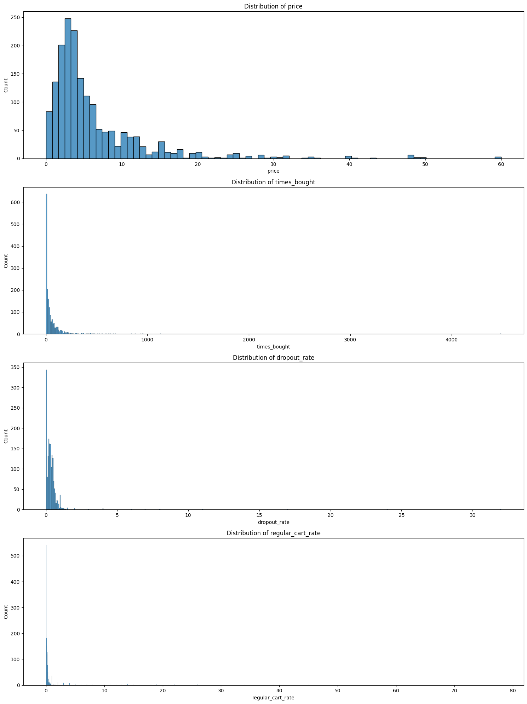
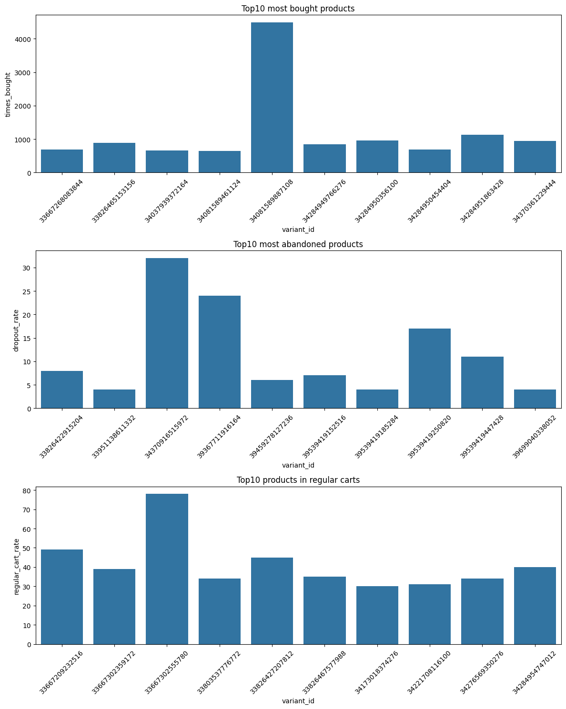
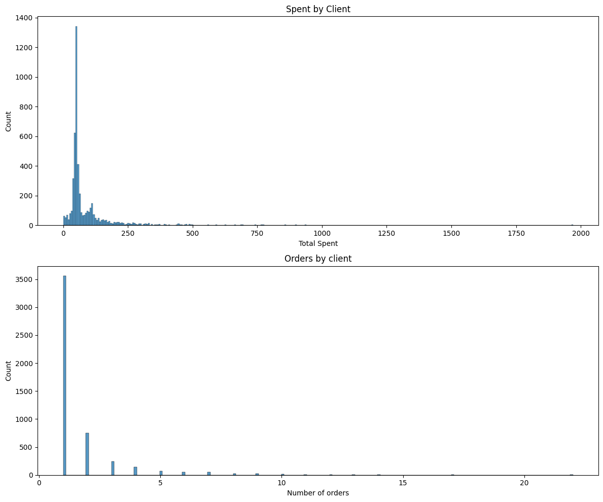
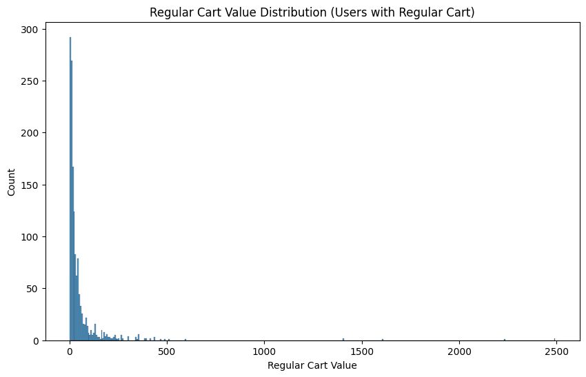

```python
from dotenv import load_dotenv
import os
import boto3
import pandas as pd
import matplotlib.pyplot as plt
import seaborn as sns

datasets = ['abandoned_carts', 'inventory', 'orders', 'regulars', 'users']
```

Datasets are downloaded and charged in pandas dataframes.


```python

load_dotenv()
session = boto3.Session(
    aws_access_key_id=os.getenv("AWS_ACCESS_KEY_ID"),
    aws_secret_access_key=os.getenv("AWS_SECRET_ACCESS_KEY"),
)

s3 = session.client("s3")

bucket_name = "zrive-ds-data"
path = "groceries/sampled-datasets/"
error_count = 0
for dataset in datasets:
    object_key = path + dataset + ".parquet"
    local_path = "/home/lucas/zrive-ds/data/module_2/" + dataset
    try:
        s3.download_file(bucket_name, object_key, local_path)
        print(f"File {dataset} downloaded succesfully.")
    except Exception as e:
        print(f"File {dataset} not found : {e}")
        error_count += 1
        continue
if error_count == 0:
    print("All files downloaded successfully.")


```

    File abandoned_carts downloaded succesfully.
    File inventory downloaded succesfully.
    File orders downloaded succesfully.
    File regulars downloaded succesfully.
    File users downloaded succesfully.
    All files downloaded successfully.


```python
data = {}
for dataset in datasets:
    local_path = "/home/lucas/zrive-ds/data/module_2/" + dataset
    try:
        data[dataset] = pd.read_parquet(local_path)
        print(f"File {dataset} loaded successfully.")
    except Exception as e:
        continue

```

    File orders loaded successfully.
    File regulars loaded successfully.
    File abandoned_carts loaded successfully.
    File inventory loaded successfully.
    File users loaded successfully.


Different datasets are revised briefly with .info and .head methods to gain intuition about its structure.


```python
data['orders'].info()
```

    <class 'pandas.core.frame.DataFrame'>
    Index: 8773 entries, 10 to 64538
    Data columns (total 6 columns):
     #   Column          Non-Null Count  Dtype         
    ---  ------          --------------  -----         
     0   id              8773 non-null   int64         
     1   user_id         8773 non-null   object        
     2   created_at      8773 non-null   datetime64[ns]
     3   order_date      8773 non-null   datetime64[ns]
     4   user_order_seq  8773 non-null   int64         
     5   ordered_items   8773 non-null   object        
    dtypes: datetime64[ns](2), int64(2), object(2)
    memory usage: 479.8+ KB


```python
data["orders"].head()

```


<div>
<style scoped>
    .dataframe tbody tr th:only-of-type {
        vertical-align: middle;
    }

    .dataframe tbody tr th {
        vertical-align: top;
    }

    .dataframe thead th {
        text-align: right;
    }
</style>
<table border="1" class="dataframe">
  <thead>
    <tr style="text-align: right;">
      <th></th>
      <th>id</th>
      <th>user_id</th>
      <th>created_at</th>
      <th>order_date</th>
      <th>user_order_seq</th>
      <th>ordered_items</th>
    </tr>
  </thead>
  <tbody>
    <tr>
      <th>10</th>
      <td>2204073066628</td>
      <td>62e271062eb827e411bd73941178d29b022f5f2de9d37f...</td>
      <td>2020-04-30 14:32:19</td>
      <td>2020-04-30</td>
      <td>1</td>
      <td>[33618849693828, 33618860179588, 3361887404045...</td>
    </tr>
    <tr>
      <th>20</th>
      <td>2204707520644</td>
      <td>bf591c887c46d5d3513142b6a855dd7ffb9cc00697f6f5...</td>
      <td>2020-04-30 17:39:00</td>
      <td>2020-04-30</td>
      <td>1</td>
      <td>[33618835243140, 33618835964036, 3361886244058...</td>
    </tr>
    <tr>
      <th>21</th>
      <td>2204838822020</td>
      <td>329f08c66abb51f8c0b8a9526670da2d94c0c6eef06700...</td>
      <td>2020-04-30 18:12:30</td>
      <td>2020-04-30</td>
      <td>1</td>
      <td>[33618891145348, 33618893570180, 3361889766618...</td>
    </tr>
    <tr>
      <th>34</th>
      <td>2208967852164</td>
      <td>f6451fce7b1c58d0effbe37fcb4e67b718193562766470...</td>
      <td>2020-05-01 19:44:11</td>
      <td>2020-05-01</td>
      <td>1</td>
      <td>[33618830196868, 33618846580868, 3361891234624...</td>
    </tr>
    <tr>
      <th>49</th>
      <td>2215889436804</td>
      <td>68e872ff888303bff58ec56a3a986f77ddebdbe5c279e7...</td>
      <td>2020-05-03 21:56:14</td>
      <td>2020-05-03</td>
      <td>1</td>
      <td>[33667166699652, 33667166699652, 3366717122163...</td>
    </tr>
  </tbody>
</table>
</div>


```python
data['orders'].describe()
```


<div>
<style scoped>
    .dataframe tbody tr th:only-of-type {
        vertical-align: middle;
    }

    .dataframe tbody tr th {
        vertical-align: top;
    }

    .dataframe thead th {
        text-align: right;
    }
</style>
<table border="1" class="dataframe">
  <thead>
    <tr style="text-align: right;">
      <th></th>
      <th>id</th>
      <th>created_at</th>
      <th>order_date</th>
      <th>user_order_seq</th>
    </tr>
  </thead>
  <tbody>
    <tr>
      <th>count</th>
      <td>8.773000e+03</td>
      <td>8773</td>
      <td>8773</td>
      <td>8773.000000</td>
    </tr>
    <tr>
      <th>mean</th>
      <td>3.684684e+12</td>
      <td>2021-08-22 03:54:18.750028288</td>
      <td>2021-08-21 12:47:21.262966016</td>
      <td>2.445116</td>
    </tr>
    <tr>
      <th>min</th>
      <td>2.204073e+12</td>
      <td>2020-04-30 14:32:19</td>
      <td>2020-04-30 00:00:00</td>
      <td>1.000000</td>
    </tr>
    <tr>
      <th>25%</th>
      <td>3.690255e+12</td>
      <td>2021-04-25 11:50:37</td>
      <td>2021-04-25 00:00:00</td>
      <td>1.000000</td>
    </tr>
    <tr>
      <th>50%</th>
      <td>3.846692e+12</td>
      <td>2021-10-11 11:29:44</td>
      <td>2021-10-11 00:00:00</td>
      <td>1.000000</td>
    </tr>
    <tr>
      <th>75%</th>
      <td>3.945086e+12</td>
      <td>2022-01-03 18:14:23</td>
      <td>2022-01-03 00:00:00</td>
      <td>3.000000</td>
    </tr>
    <tr>
      <th>max</th>
      <td>4.026732e+12</td>
      <td>2022-03-14 00:24:59</td>
      <td>2022-03-14 00:00:00</td>
      <td>25.000000</td>
    </tr>
    <tr>
      <th>std</th>
      <td>4.145437e+11</td>
      <td>NaN</td>
      <td>NaN</td>
      <td>2.707693</td>
    </tr>
  </tbody>
</table>
</div>


```python
data['regulars'].info()
```

    <class 'pandas.core.frame.DataFrame'>
    Index: 18105 entries, 3 to 37720
    Data columns (total 3 columns):
     #   Column      Non-Null Count  Dtype         
    ---  ------      --------------  -----         
     0   user_id     18105 non-null  object        
     1   variant_id  18105 non-null  int64         
     2   created_at  18105 non-null  datetime64[ns]
    dtypes: datetime64[ns](1), int64(1), object(1)
    memory usage: 565.8+ KB


```python
data['regulars'].head() 
```


<div>
<style scoped>
    .dataframe tbody tr th:only-of-type {
        vertical-align: middle;
    }

    .dataframe tbody tr th {
        vertical-align: top;
    }

    .dataframe thead th {
        text-align: right;
    }
</style>
<table border="1" class="dataframe">
  <thead>
    <tr style="text-align: right;">
      <th></th>
      <th>user_id</th>
      <th>variant_id</th>
      <th>created_at</th>
    </tr>
  </thead>
  <tbody>
    <tr>
      <th>3</th>
      <td>68e872ff888303bff58ec56a3a986f77ddebdbe5c279e7...</td>
      <td>33618848088196</td>
      <td>2020-04-30 15:07:03</td>
    </tr>
    <tr>
      <th>11</th>
      <td>aed88fc0b004270a62ff1fe4b94141f6b1db1496dbb0c0...</td>
      <td>33667178659972</td>
      <td>2020-05-05 23:34:35</td>
    </tr>
    <tr>
      <th>18</th>
      <td>68e872ff888303bff58ec56a3a986f77ddebdbe5c279e7...</td>
      <td>33619009208452</td>
      <td>2020-04-30 15:07:03</td>
    </tr>
    <tr>
      <th>46</th>
      <td>aed88fc0b004270a62ff1fe4b94141f6b1db1496dbb0c0...</td>
      <td>33667305373828</td>
      <td>2020-05-05 23:34:35</td>
    </tr>
    <tr>
      <th>47</th>
      <td>4594e99557113d5a1c5b59bf31b8704aafe5c7bd180b32...</td>
      <td>33667247341700</td>
      <td>2020-05-06 14:42:11</td>
    </tr>
  </tbody>
</table>
</div>


```python
data['regulars'].describe()
```


<div>
<style scoped>
    .dataframe tbody tr th:only-of-type {
        vertical-align: middle;
    }

    .dataframe tbody tr th {
        vertical-align: top;
    }

    .dataframe thead th {
        text-align: right;
    }
</style>
<table border="1" class="dataframe">
  <thead>
    <tr style="text-align: right;">
      <th></th>
      <th>variant_id</th>
      <th>created_at</th>
    </tr>
  </thead>
  <tbody>
    <tr>
      <th>count</th>
      <td>1.810500e+04</td>
      <td>18105</td>
    </tr>
    <tr>
      <th>mean</th>
      <td>3.511989e+13</td>
      <td>2021-08-15 02:27:30.703728384</td>
    </tr>
    <tr>
      <th>min</th>
      <td>3.361527e+13</td>
      <td>2020-04-30 13:09:27</td>
    </tr>
    <tr>
      <th>25%</th>
      <td>3.382643e+13</td>
      <td>2021-03-21 10:41:42</td>
    </tr>
    <tr>
      <th>50%</th>
      <td>3.422171e+13</td>
      <td>2021-10-16 09:11:26</td>
    </tr>
    <tr>
      <th>75%</th>
      <td>3.448855e+13</td>
      <td>2022-01-14 22:35:14</td>
    </tr>
    <tr>
      <th>max</th>
      <td>4.013362e+13</td>
      <td>2022-03-14 07:49:24</td>
    </tr>
    <tr>
      <th>std</th>
      <td>2.171237e+12</td>
      <td>NaN</td>
    </tr>
  </tbody>
</table>
</div>


```python
data['abandoned_carts'].info()
```

    <class 'pandas.core.frame.DataFrame'>
    Index: 5457 entries, 0 to 70050
    Data columns (total 4 columns):
     #   Column      Non-Null Count  Dtype         
    ---  ------      --------------  -----         
     0   id          5457 non-null   int64         
     1   user_id     5457 non-null   object        
     2   created_at  5457 non-null   datetime64[ns]
     3   variant_id  5457 non-null   object        
    dtypes: datetime64[ns](1), int64(1), object(2)
    memory usage: 213.2+ KB


```python
data['abandoned_carts'].head()
```


<div>
<style scoped>
    .dataframe tbody tr th:only-of-type {
        vertical-align: middle;
    }

    .dataframe tbody tr th {
        vertical-align: top;
    }

    .dataframe thead th {
        text-align: right;
    }
</style>
<table border="1" class="dataframe">
  <thead>
    <tr style="text-align: right;">
      <th></th>
      <th>id</th>
      <th>user_id</th>
      <th>created_at</th>
      <th>variant_id</th>
    </tr>
  </thead>
  <tbody>
    <tr>
      <th>0</th>
      <td>12858560217220</td>
      <td>5c4e5953f13ddc3bc9659a3453356155e5efe4739d7a2b...</td>
      <td>2020-05-20 13:53:24</td>
      <td>[33826459287684, 33826457616516, 3366719212762...</td>
    </tr>
    <tr>
      <th>13</th>
      <td>20352449839236</td>
      <td>9d6187545c005d39e44d0456d87790db18611d7c7379bd...</td>
      <td>2021-06-27 05:24:13</td>
      <td>[34415988179076, 34037940158596, 3450282236326...</td>
    </tr>
    <tr>
      <th>45</th>
      <td>20478401413252</td>
      <td>e83fb0273d70c37a2968fee107113698fd4f389c442c0b...</td>
      <td>2021-07-18 08:23:49</td>
      <td>[34543001337988, 34037939372164, 3411360609088...</td>
    </tr>
    <tr>
      <th>50</th>
      <td>20481783103620</td>
      <td>10c42e10e530284b7c7c50f3a23a98726d5747b8128084...</td>
      <td>2021-07-18 21:29:36</td>
      <td>[33667268116612, 34037940224132, 3443605520397...</td>
    </tr>
    <tr>
      <th>52</th>
      <td>20485321687172</td>
      <td>d9989439524b3f6fc4f41686d043f315fb408b954d6153...</td>
      <td>2021-07-19 12:17:05</td>
      <td>[33667268083844, 34284950454404, 33973246886020]</td>
    </tr>
  </tbody>
</table>
</div>


```python
data['inventory'].info()
```

    <class 'pandas.core.frame.DataFrame'>
    RangeIndex: 1733 entries, 0 to 1732
    Data columns (total 6 columns):
     #   Column            Non-Null Count  Dtype  
    ---  ------            --------------  -----  
     0   variant_id        1733 non-null   int64  
     1   price             1733 non-null   float64
     2   compare_at_price  1733 non-null   float64
     3   vendor            1733 non-null   object 
     4   product_type      1733 non-null   object 
     5   tags              1733 non-null   object 
    dtypes: float64(2), int64(1), object(3)
    memory usage: 81.4+ KB


```python
data['inventory'].head(15)
```


<div>
<style scoped>
    .dataframe tbody tr th:only-of-type {
        vertical-align: middle;
    }

    .dataframe tbody tr th {
        vertical-align: top;
    }

    .dataframe thead th {
        text-align: right;
    }
</style>
<table border="1" class="dataframe">
  <thead>
    <tr style="text-align: right;">
      <th></th>
      <th>variant_id</th>
      <th>price</th>
      <th>compare_at_price</th>
      <th>vendor</th>
      <th>product_type</th>
      <th>tags</th>
    </tr>
  </thead>
  <tbody>
    <tr>
      <th>0</th>
      <td>39587297165444</td>
      <td>3.09</td>
      <td>3.15</td>
      <td>heinz</td>
      <td>condiments-dressings</td>
      <td>[table-sauces, vegan]</td>
    </tr>
    <tr>
      <th>1</th>
      <td>34370361229444</td>
      <td>4.99</td>
      <td>5.50</td>
      <td>whogivesacrap</td>
      <td>toilet-roll-kitchen-roll-tissue</td>
      <td>[b-corp, eco, toilet-rolls]</td>
    </tr>
    <tr>
      <th>2</th>
      <td>34284951863428</td>
      <td>3.69</td>
      <td>3.99</td>
      <td>plenty</td>
      <td>toilet-roll-kitchen-roll-tissue</td>
      <td>[kitchen-roll]</td>
    </tr>
    <tr>
      <th>3</th>
      <td>33667283583108</td>
      <td>1.79</td>
      <td>1.99</td>
      <td>thecheekypanda</td>
      <td>toilet-roll-kitchen-roll-tissue</td>
      <td>[b-corp, cruelty-free, eco, tissue, vegan]</td>
    </tr>
    <tr>
      <th>4</th>
      <td>33803537973380</td>
      <td>1.99</td>
      <td>2.09</td>
      <td>colgate</td>
      <td>dental</td>
      <td>[dental-accessories]</td>
    </tr>
    <tr>
      <th>5</th>
      <td>34460976447620</td>
      <td>2.79</td>
      <td>2.85</td>
      <td>carex</td>
      <td>hand-soap-sanitisers</td>
      <td>[hand-soap, refills]</td>
    </tr>
    <tr>
      <th>6</th>
      <td>33667202121860</td>
      <td>8.99</td>
      <td>12.55</td>
      <td>ecover</td>
      <td>washing-liquid-gel</td>
      <td>[cruelty-free, eco, vegan, washing-liquid-gel]</td>
    </tr>
    <tr>
      <th>7</th>
      <td>39478260695172</td>
      <td>1.99</td>
      <td>2.00</td>
      <td>napolina</td>
      <td>cooking-sauces</td>
      <td>[pasta-pizza-sauce, vegan]</td>
    </tr>
    <tr>
      <th>8</th>
      <td>39772627533956</td>
      <td>1.99</td>
      <td>2.30</td>
      <td>thepinkstuff</td>
      <td>cleaning-products</td>
      <td>[all-purpose-cleaner, vegan]</td>
    </tr>
    <tr>
      <th>9</th>
      <td>39887964766340</td>
      <td>2.59</td>
      <td>2.69</td>
      <td>profusion</td>
      <td>tins-packaged-foods</td>
      <td>[gluten-free, meat-alternatives, organic, vegan]</td>
    </tr>
    <tr>
      <th>10</th>
      <td>34276570955908</td>
      <td>2.99</td>
      <td>3.99</td>
      <td>eatnatural</td>
      <td>cereal</td>
      <td>[muesli-granola]</td>
    </tr>
    <tr>
      <th>11</th>
      <td>39506484428932</td>
      <td>3.29</td>
      <td>4.90</td>
      <td>belvoir</td>
      <td>soft-drinks-mixers</td>
      <td>[squash, vegan]</td>
    </tr>
    <tr>
      <th>12</th>
      <td>34284951994500</td>
      <td>3.49</td>
      <td>4.00</td>
      <td>simple</td>
      <td>skincare</td>
      <td>[facial-skincare]</td>
    </tr>
    <tr>
      <th>13</th>
      <td>39497612886148</td>
      <td>3.49</td>
      <td>3.50</td>
      <td>sauceshop</td>
      <td>cooking-sauces</td>
      <td>[carbon-neutral, christmas, cruelty-free, curr...</td>
    </tr>
    <tr>
      <th>14</th>
      <td>33863279640708</td>
      <td>1.89</td>
      <td>3.69</td>
      <td>radox</td>
      <td>bath-shower-gel</td>
      <td>[shower-gel]</td>
    </tr>
  </tbody>
</table>
</div>


```python
data['users'].info()
```

    <class 'pandas.core.frame.DataFrame'>
    Index: 4983 entries, 2160 to 3360
    Data columns (total 10 columns):
     #   Column                 Non-Null Count  Dtype  
    ---  ------                 --------------  -----  
     0   user_id                4983 non-null   object 
     1   user_segment           4983 non-null   object 
     2   user_nuts1             4932 non-null   object 
     3   first_ordered_at       4983 non-null   object 
     4   customer_cohort_month  4983 non-null   object 
     5   count_people           325 non-null    float64
     6   count_adults           325 non-null    float64
     7   count_children         325 non-null    float64
     8   count_babies           325 non-null    float64
     9   count_pets             325 non-null    float64
    dtypes: float64(5), object(5)
    memory usage: 428.2+ KB


```python
data['users'].loc[data['users']['count_adults'].notnull()].head(15)
```


<div>
<style scoped>
    .dataframe tbody tr th:only-of-type {
        vertical-align: middle;
    }

    .dataframe tbody tr th {
        vertical-align: top;
    }

    .dataframe thead th {
        text-align: right;
    }
</style>
<table border="1" class="dataframe">
  <thead>
    <tr style="text-align: right;">
      <th></th>
      <th>user_id</th>
      <th>user_segment</th>
      <th>user_nuts1</th>
      <th>first_ordered_at</th>
      <th>customer_cohort_month</th>
      <th>count_people</th>
      <th>count_adults</th>
      <th>count_children</th>
      <th>count_babies</th>
      <th>count_pets</th>
    </tr>
  </thead>
  <tbody>
    <tr>
      <th>4751</th>
      <td>09d70e0b0778117aec5550c08032d56f8e06f992741680...</td>
      <td>Proposition</td>
      <td>UKI</td>
      <td>2021-06-28 12:07:04</td>
      <td>2021-06-01 00:00:00</td>
      <td>1.0</td>
      <td>1.0</td>
      <td>0.0</td>
      <td>0.0</td>
      <td>0.0</td>
    </tr>
    <tr>
      <th>3154</th>
      <td>4f5ff38ce5ed48096ba80dff80e167db1ad24b9ebdb00c...</td>
      <td>Top Up</td>
      <td>UKD</td>
      <td>2020-06-12 12:07:35</td>
      <td>2020-06-01 00:00:00</td>
      <td>3.0</td>
      <td>2.0</td>
      <td>0.0</td>
      <td>1.0</td>
      <td>0.0</td>
    </tr>
    <tr>
      <th>736</th>
      <td>7b2ae50bb11646436fa613394fc3e71e1a0cdc3ba30cdb...</td>
      <td>Proposition</td>
      <td>UKF</td>
      <td>2020-10-03 09:53:57</td>
      <td>2020-10-01 00:00:00</td>
      <td>2.0</td>
      <td>2.0</td>
      <td>0.0</td>
      <td>0.0</td>
      <td>2.0</td>
    </tr>
    <tr>
      <th>4792</th>
      <td>5e977a4aa2c57f306b8a22f92eaaa177f7dc31a52df82c...</td>
      <td>Proposition</td>
      <td>UKI</td>
      <td>2021-10-14 10:41:13</td>
      <td>2021-10-01 00:00:00</td>
      <td>2.0</td>
      <td>1.0</td>
      <td>1.0</td>
      <td>0.0</td>
      <td>1.0</td>
    </tr>
    <tr>
      <th>2217</th>
      <td>eafb89ad33eb377adb98a915b6a5a65f1284c2db517d07...</td>
      <td>Proposition</td>
      <td>UKH</td>
      <td>2022-01-20 15:53:09</td>
      <td>2022-01-01 00:00:00</td>
      <td>2.0</td>
      <td>2.0</td>
      <td>0.0</td>
      <td>0.0</td>
      <td>0.0</td>
    </tr>
    <tr>
      <th>1501</th>
      <td>2d20842e0b680c1143a4daaabffd6c7b018b2fe4062a70...</td>
      <td>Proposition</td>
      <td>UKK</td>
      <td>2020-05-11 19:04:39</td>
      <td>2020-05-01 00:00:00</td>
      <td>3.0</td>
      <td>2.0</td>
      <td>0.0</td>
      <td>1.0</td>
      <td>0.0</td>
    </tr>
    <tr>
      <th>2288</th>
      <td>a5dc433a53fc583e76e83e4c5221676898982e6ce4c7fb...</td>
      <td>Proposition</td>
      <td>UKH</td>
      <td>2021-11-04 10:10:41</td>
      <td>2021-11-01 00:00:00</td>
      <td>2.0</td>
      <td>2.0</td>
      <td>0.0</td>
      <td>0.0</td>
      <td>0.0</td>
    </tr>
    <tr>
      <th>3294</th>
      <td>1b7eba7caa62e5551978b33eefe1385aa51a48b6877246...</td>
      <td>Top Up</td>
      <td>UKK</td>
      <td>2022-01-21 18:48:00</td>
      <td>2022-01-01 00:00:00</td>
      <td>1.0</td>
      <td>1.0</td>
      <td>0.0</td>
      <td>0.0</td>
      <td>0.0</td>
    </tr>
    <tr>
      <th>4569</th>
      <td>cc7705f1921269ddd471ee6d303c650659057ac951aa74...</td>
      <td>Top Up</td>
      <td>UKC</td>
      <td>2020-07-31 13:19:50</td>
      <td>2020-07-01 00:00:00</td>
      <td>3.0</td>
      <td>3.0</td>
      <td>0.0</td>
      <td>0.0</td>
      <td>0.0</td>
    </tr>
    <tr>
      <th>3141</th>
      <td>a160d68057b656130a5c54749f29004982d73333f6e466...</td>
      <td>Proposition</td>
      <td>UKL</td>
      <td>2022-02-27 16:40:42</td>
      <td>2022-02-01 00:00:00</td>
      <td>3.0</td>
      <td>3.0</td>
      <td>0.0</td>
      <td>0.0</td>
      <td>0.0</td>
    </tr>
    <tr>
      <th>429</th>
      <td>295739f82a727b045a6ebb99cc79bd41567958b4d41274...</td>
      <td>Proposition</td>
      <td>UKK</td>
      <td>2021-04-27 01:31:56</td>
      <td>2021-04-01 00:00:00</td>
      <td>2.0</td>
      <td>2.0</td>
      <td>0.0</td>
      <td>0.0</td>
      <td>0.0</td>
    </tr>
    <tr>
      <th>642</th>
      <td>88ffc05de4956c32eb48a1d1ba7536ebf12e14edaad0bb...</td>
      <td>Top Up</td>
      <td>UKK</td>
      <td>2021-10-25 16:45:34</td>
      <td>2021-10-01 00:00:00</td>
      <td>3.0</td>
      <td>2.0</td>
      <td>1.0</td>
      <td>0.0</td>
      <td>1.0</td>
    </tr>
    <tr>
      <th>2105</th>
      <td>10c42e10e530284b7c7c50f3a23a98726d5747b8128084...</td>
      <td>Proposition</td>
      <td>UKI</td>
      <td>2021-07-18 22:29:26</td>
      <td>2021-07-01 00:00:00</td>
      <td>2.0</td>
      <td>2.0</td>
      <td>0.0</td>
      <td>0.0</td>
      <td>0.0</td>
    </tr>
    <tr>
      <th>723</th>
      <td>f18c85639b432d6e9f50c4c48ba40320d7a851d359a7d6...</td>
      <td>Top Up</td>
      <td>UKD</td>
      <td>2021-03-26 23:50:22</td>
      <td>2021-03-01 00:00:00</td>
      <td>3.0</td>
      <td>3.0</td>
      <td>0.0</td>
      <td>0.0</td>
      <td>0.0</td>
    </tr>
    <tr>
      <th>1424</th>
      <td>c9f4bccfc864b67ed9f809ba72befd644ddee3d90eb70e...</td>
      <td>Proposition</td>
      <td>UKJ</td>
      <td>2021-10-21 16:02:40</td>
      <td>2021-10-01 00:00:00</td>
      <td>2.0</td>
      <td>2.0</td>
      <td>0.0</td>
      <td>0.0</td>
      <td>2.0</td>
    </tr>
  </tbody>
</table>
</div>


```python
data['users']['user_segment'].unique()
```


    array(['Top Up', 'Proposition'], dtype=object)


Once a brief revision is done, the aim of this analysis is to gain knowledge about how products and customers behave in the dataset.
For this, new features such as times_bought (times a product appears in an order) will be computed.


```python
for product in data['inventory']['variant_id'].unique():
    products_bought = 0
    for order in data['orders']['ordered_items']:
        products_bought += order.count(product)
    data['inventory'].loc[data['inventory']['variant_id'] == product, 'times_bought'] = int(products_bought)

data['inventory'].head(15)
```


<div>
<style scoped>
    .dataframe tbody tr th:only-of-type {
        vertical-align: middle;
    }

    .dataframe tbody tr th {
        vertical-align: top;
    }

    .dataframe thead th {
        text-align: right;
    }
</style>
<table border="1" class="dataframe">
  <thead>
    <tr style="text-align: right;">
      <th></th>
      <th>variant_id</th>
      <th>price</th>
      <th>compare_at_price</th>
      <th>vendor</th>
      <th>product_type</th>
      <th>tags</th>
      <th>times_bought</th>
    </tr>
  </thead>
  <tbody>
    <tr>
      <th>0</th>
      <td>39587297165444</td>
      <td>3.09</td>
      <td>3.15</td>
      <td>heinz</td>
      <td>condiments-dressings</td>
      <td>[table-sauces, vegan]</td>
      <td>552.0</td>
    </tr>
    <tr>
      <th>1</th>
      <td>34370361229444</td>
      <td>4.99</td>
      <td>5.50</td>
      <td>whogivesacrap</td>
      <td>toilet-roll-kitchen-roll-tissue</td>
      <td>[b-corp, eco, toilet-rolls]</td>
      <td>939.0</td>
    </tr>
    <tr>
      <th>2</th>
      <td>34284951863428</td>
      <td>3.69</td>
      <td>3.99</td>
      <td>plenty</td>
      <td>toilet-roll-kitchen-roll-tissue</td>
      <td>[kitchen-roll]</td>
      <td>1133.0</td>
    </tr>
    <tr>
      <th>3</th>
      <td>33667283583108</td>
      <td>1.79</td>
      <td>1.99</td>
      <td>thecheekypanda</td>
      <td>toilet-roll-kitchen-roll-tissue</td>
      <td>[b-corp, cruelty-free, eco, tissue, vegan]</td>
      <td>129.0</td>
    </tr>
    <tr>
      <th>4</th>
      <td>33803537973380</td>
      <td>1.99</td>
      <td>2.09</td>
      <td>colgate</td>
      <td>dental</td>
      <td>[dental-accessories]</td>
      <td>183.0</td>
    </tr>
    <tr>
      <th>5</th>
      <td>34460976447620</td>
      <td>2.79</td>
      <td>2.85</td>
      <td>carex</td>
      <td>hand-soap-sanitisers</td>
      <td>[hand-soap, refills]</td>
      <td>421.0</td>
    </tr>
    <tr>
      <th>6</th>
      <td>33667202121860</td>
      <td>8.99</td>
      <td>12.55</td>
      <td>ecover</td>
      <td>washing-liquid-gel</td>
      <td>[cruelty-free, eco, vegan, washing-liquid-gel]</td>
      <td>96.0</td>
    </tr>
    <tr>
      <th>7</th>
      <td>39478260695172</td>
      <td>1.99</td>
      <td>2.00</td>
      <td>napolina</td>
      <td>cooking-sauces</td>
      <td>[pasta-pizza-sauce, vegan]</td>
      <td>62.0</td>
    </tr>
    <tr>
      <th>8</th>
      <td>39772627533956</td>
      <td>1.99</td>
      <td>2.30</td>
      <td>thepinkstuff</td>
      <td>cleaning-products</td>
      <td>[all-purpose-cleaner, vegan]</td>
      <td>204.0</td>
    </tr>
    <tr>
      <th>9</th>
      <td>39887964766340</td>
      <td>2.59</td>
      <td>2.69</td>
      <td>profusion</td>
      <td>tins-packaged-foods</td>
      <td>[gluten-free, meat-alternatives, organic, vegan]</td>
      <td>8.0</td>
    </tr>
    <tr>
      <th>10</th>
      <td>34276570955908</td>
      <td>2.99</td>
      <td>3.99</td>
      <td>eatnatural</td>
      <td>cereal</td>
      <td>[muesli-granola]</td>
      <td>81.0</td>
    </tr>
    <tr>
      <th>11</th>
      <td>39506484428932</td>
      <td>3.29</td>
      <td>4.90</td>
      <td>belvoir</td>
      <td>soft-drinks-mixers</td>
      <td>[squash, vegan]</td>
      <td>57.0</td>
    </tr>
    <tr>
      <th>12</th>
      <td>34284951994500</td>
      <td>3.49</td>
      <td>4.00</td>
      <td>simple</td>
      <td>skincare</td>
      <td>[facial-skincare]</td>
      <td>2.0</td>
    </tr>
    <tr>
      <th>13</th>
      <td>39497612886148</td>
      <td>3.49</td>
      <td>3.50</td>
      <td>sauceshop</td>
      <td>cooking-sauces</td>
      <td>[carbon-neutral, christmas, cruelty-free, curr...</td>
      <td>7.0</td>
    </tr>
    <tr>
      <th>14</th>
      <td>33863279640708</td>
      <td>1.89</td>
      <td>3.69</td>
      <td>radox</td>
      <td>bath-shower-gel</td>
      <td>[shower-gel]</td>
      <td>119.0</td>
    </tr>
  </tbody>
</table>
</div>


```python
for product in data['inventory']['variant_id'].unique():
    products_abandoned = 0
    for cart in data['abandoned_carts']['variant_id']:
        products_abandoned += cart.count(product)
    data['inventory'].loc[data['inventory']['variant_id'] == product, 'times_abandoned'] = int(products_abandoned)

data['inventory']['dropout_rate'] = data['inventory']['times_abandoned'] / (data['inventory']['times_bought'] + 1)
data['inventory'].drop('times_abandoned', axis=1, inplace=True)

data['inventory'].head(15)
```


<div>
<style scoped>
    .dataframe tbody tr th:only-of-type {
        vertical-align: middle;
    }

    .dataframe tbody tr th {
        vertical-align: top;
    }

    .dataframe thead th {
        text-align: right;
    }
</style>
<table border="1" class="dataframe">
  <thead>
    <tr style="text-align: right;">
      <th></th>
      <th>variant_id</th>
      <th>price</th>
      <th>compare_at_price</th>
      <th>vendor</th>
      <th>product_type</th>
      <th>tags</th>
      <th>times_bought</th>
      <th>dropout_rate</th>
    </tr>
  </thead>
  <tbody>
    <tr>
      <th>0</th>
      <td>39587297165444</td>
      <td>3.09</td>
      <td>3.15</td>
      <td>heinz</td>
      <td>condiments-dressings</td>
      <td>[table-sauces, vegan]</td>
      <td>552.0</td>
      <td>0.108499</td>
    </tr>
    <tr>
      <th>1</th>
      <td>34370361229444</td>
      <td>4.99</td>
      <td>5.50</td>
      <td>whogivesacrap</td>
      <td>toilet-roll-kitchen-roll-tissue</td>
      <td>[b-corp, eco, toilet-rolls]</td>
      <td>939.0</td>
      <td>0.269149</td>
    </tr>
    <tr>
      <th>2</th>
      <td>34284951863428</td>
      <td>3.69</td>
      <td>3.99</td>
      <td>plenty</td>
      <td>toilet-roll-kitchen-roll-tissue</td>
      <td>[kitchen-roll]</td>
      <td>1133.0</td>
      <td>0.421517</td>
    </tr>
    <tr>
      <th>3</th>
      <td>33667283583108</td>
      <td>1.79</td>
      <td>1.99</td>
      <td>thecheekypanda</td>
      <td>toilet-roll-kitchen-roll-tissue</td>
      <td>[b-corp, cruelty-free, eco, tissue, vegan]</td>
      <td>129.0</td>
      <td>0.353846</td>
    </tr>
    <tr>
      <th>4</th>
      <td>33803537973380</td>
      <td>1.99</td>
      <td>2.09</td>
      <td>colgate</td>
      <td>dental</td>
      <td>[dental-accessories]</td>
      <td>183.0</td>
      <td>0.451087</td>
    </tr>
    <tr>
      <th>5</th>
      <td>34460976447620</td>
      <td>2.79</td>
      <td>2.85</td>
      <td>carex</td>
      <td>hand-soap-sanitisers</td>
      <td>[hand-soap, refills]</td>
      <td>421.0</td>
      <td>0.386256</td>
    </tr>
    <tr>
      <th>6</th>
      <td>33667202121860</td>
      <td>8.99</td>
      <td>12.55</td>
      <td>ecover</td>
      <td>washing-liquid-gel</td>
      <td>[cruelty-free, eco, vegan, washing-liquid-gel]</td>
      <td>96.0</td>
      <td>0.268041</td>
    </tr>
    <tr>
      <th>7</th>
      <td>39478260695172</td>
      <td>1.99</td>
      <td>2.00</td>
      <td>napolina</td>
      <td>cooking-sauces</td>
      <td>[pasta-pizza-sauce, vegan]</td>
      <td>62.0</td>
      <td>0.492063</td>
    </tr>
    <tr>
      <th>8</th>
      <td>39772627533956</td>
      <td>1.99</td>
      <td>2.30</td>
      <td>thepinkstuff</td>
      <td>cleaning-products</td>
      <td>[all-purpose-cleaner, vegan]</td>
      <td>204.0</td>
      <td>0.282927</td>
    </tr>
    <tr>
      <th>9</th>
      <td>39887964766340</td>
      <td>2.59</td>
      <td>2.69</td>
      <td>profusion</td>
      <td>tins-packaged-foods</td>
      <td>[gluten-free, meat-alternatives, organic, vegan]</td>
      <td>8.0</td>
      <td>0.333333</td>
    </tr>
    <tr>
      <th>10</th>
      <td>34276570955908</td>
      <td>2.99</td>
      <td>3.99</td>
      <td>eatnatural</td>
      <td>cereal</td>
      <td>[muesli-granola]</td>
      <td>81.0</td>
      <td>0.268293</td>
    </tr>
    <tr>
      <th>11</th>
      <td>39506484428932</td>
      <td>3.29</td>
      <td>4.90</td>
      <td>belvoir</td>
      <td>soft-drinks-mixers</td>
      <td>[squash, vegan]</td>
      <td>57.0</td>
      <td>0.310345</td>
    </tr>
    <tr>
      <th>12</th>
      <td>34284951994500</td>
      <td>3.49</td>
      <td>4.00</td>
      <td>simple</td>
      <td>skincare</td>
      <td>[facial-skincare]</td>
      <td>2.0</td>
      <td>0.000000</td>
    </tr>
    <tr>
      <th>13</th>
      <td>39497612886148</td>
      <td>3.49</td>
      <td>3.50</td>
      <td>sauceshop</td>
      <td>cooking-sauces</td>
      <td>[carbon-neutral, christmas, cruelty-free, curr...</td>
      <td>7.0</td>
      <td>0.875000</td>
    </tr>
    <tr>
      <th>14</th>
      <td>33863279640708</td>
      <td>1.89</td>
      <td>3.69</td>
      <td>radox</td>
      <td>bath-shower-gel</td>
      <td>[shower-gel]</td>
      <td>119.0</td>
      <td>0.266667</td>
    </tr>
  </tbody>
</table>
</div>


```python
for product in data['inventory']['variant_id'].unique():
    regular_products = 0
    for regular_product in data['regulars']['variant_id']:
        if product == regular_product:
            regular_products += 1
    data['inventory'].loc[data['inventory']['variant_id'] == product, 'regular_cart_appearances'] = int(regular_products)

data['inventory']['regular_cart_rate'] = data['inventory']['regular_cart_appearances'] / (data['inventory']['times_bought'] + 1)
data['inventory'].drop('regular_cart_appearances', axis=1, inplace=True)

data['inventory'].head(15)
```


<div>
<style scoped>
    .dataframe tbody tr th:only-of-type {
        vertical-align: middle;
    }

    .dataframe tbody tr th {
        vertical-align: top;
    }

    .dataframe thead th {
        text-align: right;
    }
</style>
<table border="1" class="dataframe">
  <thead>
    <tr style="text-align: right;">
      <th></th>
      <th>variant_id</th>
      <th>price</th>
      <th>compare_at_price</th>
      <th>vendor</th>
      <th>product_type</th>
      <th>tags</th>
      <th>times_bought</th>
      <th>dropout_rate</th>
      <th>regular_cart_rate</th>
    </tr>
  </thead>
  <tbody>
    <tr>
      <th>0</th>
      <td>39587297165444</td>
      <td>3.09</td>
      <td>3.15</td>
      <td>heinz</td>
      <td>condiments-dressings</td>
      <td>[table-sauces, vegan]</td>
      <td>552.0</td>
      <td>0.108499</td>
      <td>0.025316</td>
    </tr>
    <tr>
      <th>1</th>
      <td>34370361229444</td>
      <td>4.99</td>
      <td>5.50</td>
      <td>whogivesacrap</td>
      <td>toilet-roll-kitchen-roll-tissue</td>
      <td>[b-corp, eco, toilet-rolls]</td>
      <td>939.0</td>
      <td>0.269149</td>
      <td>0.135106</td>
    </tr>
    <tr>
      <th>2</th>
      <td>34284951863428</td>
      <td>3.69</td>
      <td>3.99</td>
      <td>plenty</td>
      <td>toilet-roll-kitchen-roll-tissue</td>
      <td>[kitchen-roll]</td>
      <td>1133.0</td>
      <td>0.421517</td>
      <td>0.092593</td>
    </tr>
    <tr>
      <th>3</th>
      <td>33667283583108</td>
      <td>1.79</td>
      <td>1.99</td>
      <td>thecheekypanda</td>
      <td>toilet-roll-kitchen-roll-tissue</td>
      <td>[b-corp, cruelty-free, eco, tissue, vegan]</td>
      <td>129.0</td>
      <td>0.353846</td>
      <td>0.246154</td>
    </tr>
    <tr>
      <th>4</th>
      <td>33803537973380</td>
      <td>1.99</td>
      <td>2.09</td>
      <td>colgate</td>
      <td>dental</td>
      <td>[dental-accessories]</td>
      <td>183.0</td>
      <td>0.451087</td>
      <td>0.070652</td>
    </tr>
    <tr>
      <th>5</th>
      <td>34460976447620</td>
      <td>2.79</td>
      <td>2.85</td>
      <td>carex</td>
      <td>hand-soap-sanitisers</td>
      <td>[hand-soap, refills]</td>
      <td>421.0</td>
      <td>0.386256</td>
      <td>0.113744</td>
    </tr>
    <tr>
      <th>6</th>
      <td>33667202121860</td>
      <td>8.99</td>
      <td>12.55</td>
      <td>ecover</td>
      <td>washing-liquid-gel</td>
      <td>[cruelty-free, eco, vegan, washing-liquid-gel]</td>
      <td>96.0</td>
      <td>0.268041</td>
      <td>0.257732</td>
    </tr>
    <tr>
      <th>7</th>
      <td>39478260695172</td>
      <td>1.99</td>
      <td>2.00</td>
      <td>napolina</td>
      <td>cooking-sauces</td>
      <td>[pasta-pizza-sauce, vegan]</td>
      <td>62.0</td>
      <td>0.492063</td>
      <td>0.015873</td>
    </tr>
    <tr>
      <th>8</th>
      <td>39772627533956</td>
      <td>1.99</td>
      <td>2.30</td>
      <td>thepinkstuff</td>
      <td>cleaning-products</td>
      <td>[all-purpose-cleaner, vegan]</td>
      <td>204.0</td>
      <td>0.282927</td>
      <td>0.004878</td>
    </tr>
    <tr>
      <th>9</th>
      <td>39887964766340</td>
      <td>2.59</td>
      <td>2.69</td>
      <td>profusion</td>
      <td>tins-packaged-foods</td>
      <td>[gluten-free, meat-alternatives, organic, vegan]</td>
      <td>8.0</td>
      <td>0.333333</td>
      <td>0.333333</td>
    </tr>
    <tr>
      <th>10</th>
      <td>34276570955908</td>
      <td>2.99</td>
      <td>3.99</td>
      <td>eatnatural</td>
      <td>cereal</td>
      <td>[muesli-granola]</td>
      <td>81.0</td>
      <td>0.268293</td>
      <td>0.109756</td>
    </tr>
    <tr>
      <th>11</th>
      <td>39506484428932</td>
      <td>3.29</td>
      <td>4.90</td>
      <td>belvoir</td>
      <td>soft-drinks-mixers</td>
      <td>[squash, vegan]</td>
      <td>57.0</td>
      <td>0.310345</td>
      <td>0.103448</td>
    </tr>
    <tr>
      <th>12</th>
      <td>34284951994500</td>
      <td>3.49</td>
      <td>4.00</td>
      <td>simple</td>
      <td>skincare</td>
      <td>[facial-skincare]</td>
      <td>2.0</td>
      <td>0.000000</td>
      <td>0.000000</td>
    </tr>
    <tr>
      <th>13</th>
      <td>39497612886148</td>
      <td>3.49</td>
      <td>3.50</td>
      <td>sauceshop</td>
      <td>cooking-sauces</td>
      <td>[carbon-neutral, christmas, cruelty-free, curr...</td>
      <td>7.0</td>
      <td>0.875000</td>
      <td>0.500000</td>
    </tr>
    <tr>
      <th>14</th>
      <td>33863279640708</td>
      <td>1.89</td>
      <td>3.69</td>
      <td>radox</td>
      <td>bath-shower-gel</td>
      <td>[shower-gel]</td>
      <td>119.0</td>
      <td>0.266667</td>
      <td>0.091667</td>
    </tr>
  </tbody>
</table>
</div>


```python
numeric_cols = ['price','times_bought', 'dropout_rate', 'regular_cart_rate']
fig, axes = plt.subplots(len(numeric_cols), figsize=(15, 5*len(numeric_cols)))

for i, col in enumerate(numeric_cols):
    
    sns.histplot(data=data['inventory'], x=col, ax=axes[i])
    axes[i].set_title(f'Distribution of {col}')
    axes[i].set_xlabel(col)

plt.tight_layout()
plt.show()

print(data['inventory'][numeric_cols].describe())
```


    

    


                 price  times_bought  dropout_rate  regular_cart_rate
    count  1733.000000   1733.000000   1733.000000        1733.000000
    mean      6.307351     53.295441      0.383842           0.856168
    std       7.107218    141.313936      1.143014           4.041948
    min       0.000000      0.000000      0.000000           0.000000
    25%       2.490000      4.000000      0.120000           0.000000
    50%       3.990000     19.000000      0.272727           0.125000
    75%       7.490000     60.000000      0.462500           0.266667
    max      59.990000   4487.000000     32.000000          78.000000


Given the distribution of the variables in inventory dataset we can see that:
- Most of products cost between 0 and 10 M.U
- Most of products have been bought no more than 100 times.
- Some products have been abandoned more times than they have been bought.
- Some products have been added to a regular cart more times than they have been bought.

The 10 products with the higher value of this metrics are shown.


```python
fig, axes = plt.subplots(3, 1, figsize=(12, 15))

top_ordered = data['inventory'].nlargest(10, 'times_bought')
sns.barplot(data=top_ordered, x='variant_id', y='times_bought', ax=axes[0])
axes[0].set_title('Top10 most bought products')
axes[0].tick_params(axis='x', rotation=45)

top_abandoned = data['inventory'].nlargest(10, 'dropout_rate')
sns.barplot(data=top_abandoned, x='variant_id', y='dropout_rate', ax=axes[1])
axes[1].set_title('Top10 most abandoned products')
axes[1].tick_params(axis='x', rotation=45)

top_regular = data['inventory'].nlargest(10, 'regular_cart_rate')
sns.barplot(data=top_regular, x='variant_id', y='regular_cart_rate', ax=axes[2])
axes[2].set_title('Top10 products in regular carts')
axes[2].tick_params(axis='x', rotation=45)

plt.tight_layout()
plt.show()
```


    

    


Now products are caracterized, users will be studied and new features will be computed. 


```python
prices = dict(zip(data['inventory']['variant_id'], data['inventory']['price']))

data['users']['total_spent'] = 0.0
data['users']['number_of_orders'] = 0

for idx, user in data['users'].iterrows():
    user_orders = data['orders'][data['orders']['user_id'] == user['user_id']]
    
    
    data['users'].loc[idx, 'number_of_orders'] = len(user_orders)
    
    
    total_spent = 0
    for order in user_orders['ordered_items']:
        for product in order:
            if product in prices:
                total_spent += prices[product]
    
    data['users'].loc[idx, 'total_spent'] = round(total_spent, 2)


print(data['users'][['total_spent', 'number_of_orders']].describe())
```

           total_spent  number_of_orders
    count  4983.000000       4983.000000
    mean     98.282777          1.745334
    std     139.967755          1.905423
    min       0.000000          1.000000
    25%      47.680000          1.000000
    50%      53.330000          1.000000
    75%      99.580000          2.000000
    max    1969.990000         22.000000


```python
fig, axes = plt.subplots(2, 1, figsize=(12, 10))

sns.histplot(data=data['users'], x='total_spent', ax=axes[0])
axes[0].set_title('Spent by Client')
axes[0].set_xlabel('Total Spent')

sns.histplot(data=data['users'], x='number_of_orders', ax=axes[1])
axes[1].set_title('Orders by client')
axes[1].set_xlabel('Number of orders')

plt.tight_layout()
plt.show()
```


    

    


New insights have been found:
- Most of the users have only spent between 0 and 125 M.U.
- Most of the users have only made one or two orders.


```python
data['users']['regular_cart_value'] = 0.0

prices = dict(zip(data['inventory']['variant_id'], data['inventory']['price']))

for idx, user in data['users'].iterrows():
    user_regular_items = data['regulars'][data['regulars']['user_id'] == user['user_id']]['variant_id']
    regular_cart_value = sum(prices[item] for item in user_regular_items if item in prices)
    data['users'].loc[idx, 'regular_cart_value'] = round(regular_cart_value, 2)

print("\nRegular cart value statistics:")
print(data['users']['regular_cart_value'].describe())
```

    
    Regular cart value statistics:
    count    4983.000000
    mean       14.456293
    std        80.134406
    min         0.000000
    25%         0.000000
    50%         0.000000
    75%         3.990000
    max      2492.950000
    Name: regular_cart_value, dtype: float64


```python
total_users = len(data['users'])
users_no_cart = len(data['users'][data['users']['regular_cart_value'] == 0])
pct_no_cart = (users_no_cart / total_users) * 100

# Crear una única figura para usuarios con carrito regular
plt.figure(figsize=(10, 6))
sns.histplot(data=data['users'][data['users']['regular_cart_value'] > 0], 
             x='regular_cart_value')
plt.title('Regular Cart Value Distribution (Users with Regular Cart)')
plt.xlabel('Regular Cart Value')
plt.show()

print(f"\nUsers with no regular cart: {users_no_cart:,} ({pct_no_cart:.1f}%)")
print("\nRegular cart value statistics for users with regular cart:")
print(data['users'][data['users']['regular_cart_value'] > 0]['regular_cart_value'].describe())
```


    

    


    
    Users with no regular cart: 3,582 (71.9%)
    
    Regular cart value statistics for users with regular cart:
    count    1401.000000
    mean       51.417352
    std       144.739943
    min         0.990000
    25%         8.990000
    50%        19.830000
    75%        46.690000
    max      2492.950000
    Name: regular_cart_value, dtype: float64


Near 72% of users does not use regular cart and most of regular carts have a value of no more than around 100 M.U.
