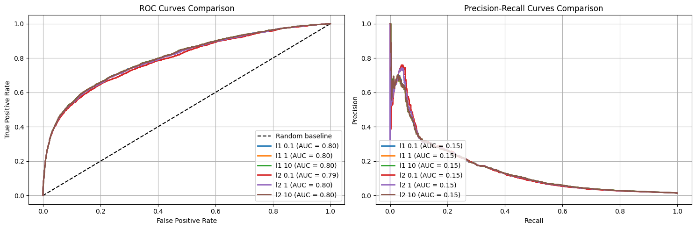
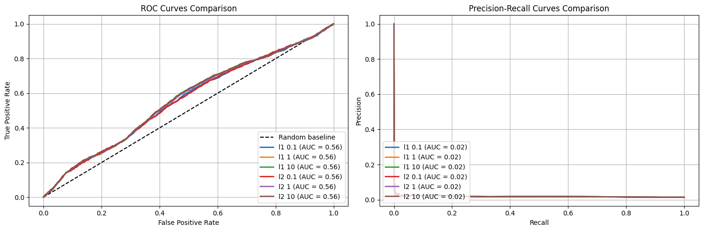
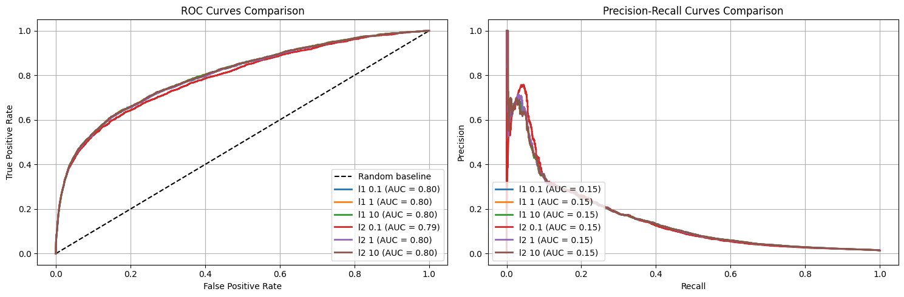
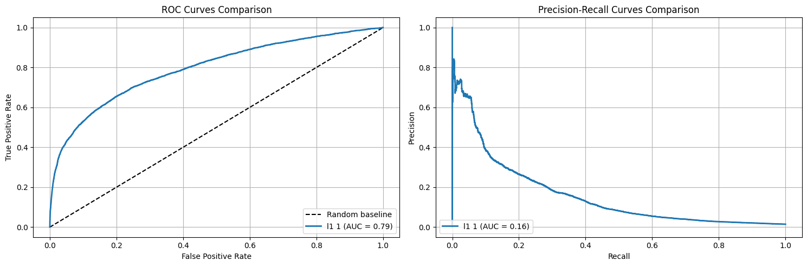
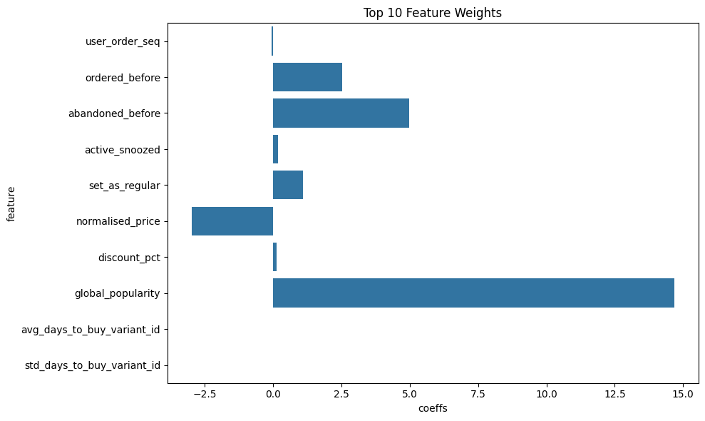

```python
from dotenv import load_dotenv
import os
import boto3
import pandas as pd
import matplotlib.pyplot as plt
import seaborn as sns
from sklearn.metrics import roc_curve, precision_recall_curve, auc
from sklearn.linear_model import LogisticRegression
from joblib import dump, load
local_path = "/home/lucas/zrive-ds/data/module_3/feature_frame.csv"
```


```python
load_dotenv()
session = boto3.Session(
    aws_access_key_id=os.getenv("AWS_ACCESS_KEY_ID"),
    aws_secret_access_key=os.getenv("AWS_SECRET_ACCESS_KEY"),
)

s3 = session.client("s3")

bucket_name = "zrive-ds-data"
path = "groceries/box_builder_dataset/feature_frame.csv"

try:
    s3.download_file(bucket_name, path, local_path)
    print(f"File downloaded succesfully.")
except Exception as e:
    print(f"File not found : {e}")
```

    File downloaded succesfully.


List with numeric and categorical columns are defined.


```python
numeric_cols = ['user_order_seq',
                'ordered_before',
                'abandoned_before',
                'active_snoozed',
                'set_as_regular',
                'normalised_price',
                'discount_pct',
                'global_popularity',
                'count_adults',
                'count_children',
                'count_babies',
                'count_pets',
                'people_ex_baby',
                'days_since_purchase_variant_id',
                'avg_days_to_buy_variant_id',
                'std_days_to_buy_variant_id',
                'days_since_purchase_product_type',
                'avg_days_to_buy_product_type',
                'std_days_to_buy_product_type'
                ]
categorical_cols = ['vendor',
                    'order_date',
                    'created_at',
                    'product_type']
```

Since it is a constraint, orders with 5 products or more are selected from the complete dataset.


```python
dataset = pd.read_csv(local_path)

orders = dataset[dataset['outcome'] == 1]

order_sizes = orders.groupby('order_id').size()

large_orders = order_sizes[order_sizes >= 5].index

selected_orders = dataset[dataset['order_id'].isin(large_orders)]

selected_orders.head(20)
```


<div>
<style scoped>
    .dataframe tbody tr th:only-of-type {
        vertical-align: middle;
    }

    .dataframe tbody tr th {
        vertical-align: top;
    }

    .dataframe thead th {
        text-align: right;
    }
</style>
<table border="1" class="dataframe">
  <thead>
    <tr style="text-align: right;">
      <th></th>
      <th>variant_id</th>
      <th>product_type</th>
      <th>order_id</th>
      <th>user_id</th>
      <th>created_at</th>
      <th>order_date</th>
      <th>user_order_seq</th>
      <th>outcome</th>
      <th>ordered_before</th>
      <th>abandoned_before</th>
      <th>...</th>
      <th>count_children</th>
      <th>count_babies</th>
      <th>count_pets</th>
      <th>people_ex_baby</th>
      <th>days_since_purchase_variant_id</th>
      <th>avg_days_to_buy_variant_id</th>
      <th>std_days_to_buy_variant_id</th>
      <th>days_since_purchase_product_type</th>
      <th>avg_days_to_buy_product_type</th>
      <th>std_days_to_buy_product_type</th>
    </tr>
  </thead>
  <tbody>
    <tr>
      <th>0</th>
      <td>33826472919172</td>
      <td>ricepastapulses</td>
      <td>2807985930372</td>
      <td>3482464092292</td>
      <td>2020-10-05 16:46:19</td>
      <td>2020-10-05 00:00:00</td>
      <td>3</td>
      <td>0.0</td>
      <td>0.0</td>
      <td>0.0</td>
      <td>...</td>
      <td>0.0</td>
      <td>0.0</td>
      <td>0.0</td>
      <td>2.0</td>
      <td>33.0</td>
      <td>42.0</td>
      <td>31.134053</td>
      <td>30.0</td>
      <td>30.0</td>
      <td>24.27618</td>
    </tr>
    <tr>
      <th>1</th>
      <td>33826472919172</td>
      <td>ricepastapulses</td>
      <td>2808027644036</td>
      <td>3466586718340</td>
      <td>2020-10-05 17:59:51</td>
      <td>2020-10-05 00:00:00</td>
      <td>2</td>
      <td>0.0</td>
      <td>0.0</td>
      <td>0.0</td>
      <td>...</td>
      <td>0.0</td>
      <td>0.0</td>
      <td>0.0</td>
      <td>2.0</td>
      <td>33.0</td>
      <td>42.0</td>
      <td>31.134053</td>
      <td>30.0</td>
      <td>30.0</td>
      <td>24.27618</td>
    </tr>
    <tr>
      <th>2</th>
      <td>33826472919172</td>
      <td>ricepastapulses</td>
      <td>2808099078276</td>
      <td>3481384026244</td>
      <td>2020-10-05 20:08:53</td>
      <td>2020-10-05 00:00:00</td>
      <td>4</td>
      <td>0.0</td>
      <td>0.0</td>
      <td>0.0</td>
      <td>...</td>
      <td>0.0</td>
      <td>0.0</td>
      <td>0.0</td>
      <td>2.0</td>
      <td>33.0</td>
      <td>42.0</td>
      <td>31.134053</td>
      <td>30.0</td>
      <td>30.0</td>
      <td>24.27618</td>
    </tr>
    <tr>
      <th>3</th>
      <td>33826472919172</td>
      <td>ricepastapulses</td>
      <td>2808393957508</td>
      <td>3291363377284</td>
      <td>2020-10-06 08:57:59</td>
      <td>2020-10-06 00:00:00</td>
      <td>2</td>
      <td>0.0</td>
      <td>0.0</td>
      <td>0.0</td>
      <td>...</td>
      <td>0.0</td>
      <td>0.0</td>
      <td>0.0</td>
      <td>2.0</td>
      <td>33.0</td>
      <td>42.0</td>
      <td>31.134053</td>
      <td>30.0</td>
      <td>30.0</td>
      <td>24.27618</td>
    </tr>
    <tr>
      <th>5</th>
      <td>33826472919172</td>
      <td>ricepastapulses</td>
      <td>2808434524292</td>
      <td>3479090790532</td>
      <td>2020-10-06 10:50:23</td>
      <td>2020-10-06 00:00:00</td>
      <td>3</td>
      <td>0.0</td>
      <td>0.0</td>
      <td>0.0</td>
      <td>...</td>
      <td>0.0</td>
      <td>0.0</td>
      <td>0.0</td>
      <td>2.0</td>
      <td>33.0</td>
      <td>42.0</td>
      <td>31.134053</td>
      <td>30.0</td>
      <td>30.0</td>
      <td>24.27618</td>
    </tr>
    <tr>
      <th>6</th>
      <td>33826472919172</td>
      <td>ricepastapulses</td>
      <td>2808548917380</td>
      <td>3476645445764</td>
      <td>2020-10-06 14:23:08</td>
      <td>2020-10-06 00:00:00</td>
      <td>5</td>
      <td>0.0</td>
      <td>1.0</td>
      <td>0.0</td>
      <td>...</td>
      <td>0.0</td>
      <td>0.0</td>
      <td>0.0</td>
      <td>2.0</td>
      <td>33.0</td>
      <td>42.0</td>
      <td>31.134053</td>
      <td>30.0</td>
      <td>30.0</td>
      <td>24.27618</td>
    </tr>
    <tr>
      <th>7</th>
      <td>33826472919172</td>
      <td>ricepastapulses</td>
      <td>2808549900420</td>
      <td>3437017956484</td>
      <td>2020-10-06 14:24:26</td>
      <td>2020-10-06 00:00:00</td>
      <td>13</td>
      <td>0.0</td>
      <td>0.0</td>
      <td>0.0</td>
      <td>...</td>
      <td>0.0</td>
      <td>0.0</td>
      <td>0.0</td>
      <td>2.0</td>
      <td>33.0</td>
      <td>42.0</td>
      <td>31.134053</td>
      <td>30.0</td>
      <td>30.0</td>
      <td>24.27618</td>
    </tr>
    <tr>
      <th>9</th>
      <td>33826472919172</td>
      <td>ricepastapulses</td>
      <td>2808728715396</td>
      <td>3421126885508</td>
      <td>2020-10-06 19:36:06</td>
      <td>2020-10-06 00:00:00</td>
      <td>2</td>
      <td>0.0</td>
      <td>0.0</td>
      <td>0.0</td>
      <td>...</td>
      <td>0.0</td>
      <td>0.0</td>
      <td>0.0</td>
      <td>2.0</td>
      <td>33.0</td>
      <td>42.0</td>
      <td>31.134053</td>
      <td>30.0</td>
      <td>30.0</td>
      <td>24.27618</td>
    </tr>
    <tr>
      <th>10</th>
      <td>33826472919172</td>
      <td>ricepastapulses</td>
      <td>2808769085572</td>
      <td>3442602868868</td>
      <td>2020-10-06 20:45:38</td>
      <td>2020-10-06 00:00:00</td>
      <td>4</td>
      <td>0.0</td>
      <td>0.0</td>
      <td>0.0</td>
      <td>...</td>
      <td>0.0</td>
      <td>0.0</td>
      <td>0.0</td>
      <td>2.0</td>
      <td>33.0</td>
      <td>42.0</td>
      <td>31.134053</td>
      <td>30.0</td>
      <td>30.0</td>
      <td>24.27618</td>
    </tr>
    <tr>
      <th>11</th>
      <td>33826472919172</td>
      <td>ricepastapulses</td>
      <td>2808786714756</td>
      <td>3486509793412</td>
      <td>2020-10-06 21:19:13</td>
      <td>2020-10-06 00:00:00</td>
      <td>4</td>
      <td>0.0</td>
      <td>0.0</td>
      <td>0.0</td>
      <td>...</td>
      <td>0.0</td>
      <td>0.0</td>
      <td>0.0</td>
      <td>2.0</td>
      <td>33.0</td>
      <td>42.0</td>
      <td>31.134053</td>
      <td>30.0</td>
      <td>30.0</td>
      <td>24.27618</td>
    </tr>
    <tr>
      <th>16</th>
      <td>33826472919172</td>
      <td>ricepastapulses</td>
      <td>2809127272580</td>
      <td>3771731083396</td>
      <td>2020-10-07 11:48:56</td>
      <td>2020-10-07 00:00:00</td>
      <td>2</td>
      <td>0.0</td>
      <td>0.0</td>
      <td>0.0</td>
      <td>...</td>
      <td>0.0</td>
      <td>0.0</td>
      <td>0.0</td>
      <td>2.0</td>
      <td>33.0</td>
      <td>42.0</td>
      <td>31.134053</td>
      <td>30.0</td>
      <td>30.0</td>
      <td>24.27618</td>
    </tr>
    <tr>
      <th>17</th>
      <td>33826472919172</td>
      <td>ricepastapulses</td>
      <td>2809189335172</td>
      <td>3223115595908</td>
      <td>2020-10-07 13:54:54</td>
      <td>2020-10-07 00:00:00</td>
      <td>9</td>
      <td>0.0</td>
      <td>0.0</td>
      <td>0.0</td>
      <td>...</td>
      <td>0.0</td>
      <td>0.0</td>
      <td>0.0</td>
      <td>2.0</td>
      <td>33.0</td>
      <td>42.0</td>
      <td>31.134053</td>
      <td>30.0</td>
      <td>30.0</td>
      <td>24.27618</td>
    </tr>
    <tr>
      <th>18</th>
      <td>33826472919172</td>
      <td>ricepastapulses</td>
      <td>2809486573700</td>
      <td>3418176061572</td>
      <td>2020-10-07 16:08:54</td>
      <td>2020-10-07 00:00:00</td>
      <td>3</td>
      <td>0.0</td>
      <td>0.0</td>
      <td>0.0</td>
      <td>...</td>
      <td>0.0</td>
      <td>0.0</td>
      <td>0.0</td>
      <td>2.0</td>
      <td>33.0</td>
      <td>42.0</td>
      <td>31.134053</td>
      <td>30.0</td>
      <td>30.0</td>
      <td>24.27618</td>
    </tr>
    <tr>
      <th>19</th>
      <td>33826472919172</td>
      <td>ricepastapulses</td>
      <td>2809696288900</td>
      <td>3510998990980</td>
      <td>2020-10-07 17:16:02</td>
      <td>2020-10-07 00:00:00</td>
      <td>3</td>
      <td>0.0</td>
      <td>0.0</td>
      <td>0.0</td>
      <td>...</td>
      <td>0.0</td>
      <td>0.0</td>
      <td>2.0</td>
      <td>2.0</td>
      <td>33.0</td>
      <td>42.0</td>
      <td>31.134053</td>
      <td>30.0</td>
      <td>30.0</td>
      <td>24.27618</td>
    </tr>
    <tr>
      <th>20</th>
      <td>33826472919172</td>
      <td>ricepastapulses</td>
      <td>2809857507460</td>
      <td>3395660513412</td>
      <td>2020-10-07 18:38:56</td>
      <td>2020-10-07 00:00:00</td>
      <td>3</td>
      <td>0.0</td>
      <td>0.0</td>
      <td>0.0</td>
      <td>...</td>
      <td>0.0</td>
      <td>0.0</td>
      <td>0.0</td>
      <td>2.0</td>
      <td>33.0</td>
      <td>42.0</td>
      <td>31.134053</td>
      <td>30.0</td>
      <td>30.0</td>
      <td>24.27618</td>
    </tr>
    <tr>
      <th>21</th>
      <td>33826472919172</td>
      <td>ricepastapulses</td>
      <td>2810124632196</td>
      <td>3766351462532</td>
      <td>2020-10-07 20:35:31</td>
      <td>2020-10-07 00:00:00</td>
      <td>2</td>
      <td>0.0</td>
      <td>0.0</td>
      <td>0.0</td>
      <td>...</td>
      <td>0.0</td>
      <td>0.0</td>
      <td>0.0</td>
      <td>2.0</td>
      <td>33.0</td>
      <td>42.0</td>
      <td>31.134053</td>
      <td>30.0</td>
      <td>30.0</td>
      <td>24.27618</td>
    </tr>
    <tr>
      <th>22</th>
      <td>33826472919172</td>
      <td>ricepastapulses</td>
      <td>2810929840260</td>
      <td>3489672626308</td>
      <td>2020-10-08 06:39:15</td>
      <td>2020-10-08 00:00:00</td>
      <td>2</td>
      <td>0.0</td>
      <td>0.0</td>
      <td>0.0</td>
      <td>...</td>
      <td>0.0</td>
      <td>0.0</td>
      <td>0.0</td>
      <td>2.0</td>
      <td>33.0</td>
      <td>42.0</td>
      <td>31.134053</td>
      <td>30.0</td>
      <td>30.0</td>
      <td>24.27618</td>
    </tr>
    <tr>
      <th>23</th>
      <td>33826472919172</td>
      <td>ricepastapulses</td>
      <td>2811003142276</td>
      <td>3432247033988</td>
      <td>2020-10-08 07:47:01</td>
      <td>2020-10-08 00:00:00</td>
      <td>5</td>
      <td>0.0</td>
      <td>0.0</td>
      <td>0.0</td>
      <td>...</td>
      <td>0.0</td>
      <td>0.0</td>
      <td>0.0</td>
      <td>2.0</td>
      <td>33.0</td>
      <td>42.0</td>
      <td>31.134053</td>
      <td>30.0</td>
      <td>30.0</td>
      <td>24.27618</td>
    </tr>
    <tr>
      <th>24</th>
      <td>33826472919172</td>
      <td>ricepastapulses</td>
      <td>2811116486788</td>
      <td>3463900528772</td>
      <td>2020-10-08 09:31:35</td>
      <td>2020-10-08 00:00:00</td>
      <td>5</td>
      <td>1.0</td>
      <td>0.0</td>
      <td>0.0</td>
      <td>...</td>
      <td>0.0</td>
      <td>0.0</td>
      <td>0.0</td>
      <td>2.0</td>
      <td>33.0</td>
      <td>42.0</td>
      <td>31.134053</td>
      <td>30.0</td>
      <td>30.0</td>
      <td>24.27618</td>
    </tr>
    <tr>
      <th>25</th>
      <td>33826472919172</td>
      <td>ricepastapulses</td>
      <td>2811176255620</td>
      <td>3315720519812</td>
      <td>2020-10-08 10:25:23</td>
      <td>2020-10-08 00:00:00</td>
      <td>2</td>
      <td>0.0</td>
      <td>0.0</td>
      <td>0.0</td>
      <td>...</td>
      <td>0.0</td>
      <td>0.0</td>
      <td>0.0</td>
      <td>2.0</td>
      <td>33.0</td>
      <td>42.0</td>
      <td>31.134053</td>
      <td>30.0</td>
      <td>30.0</td>
      <td>24.27618</td>
    </tr>
  </tbody>
</table>
<p>20 rows × 27 columns</p>
</div>


Variables weekday and time_of_day are created as it is considered that can add valuable information to the model.


```python
selected_orders['created_at'] = pd.to_datetime(selected_orders['created_at'])
selected_orders['weekday'] = selected_orders['created_at'].dt.dayofweek
categorical_cols.append('weekday')
```

    /tmp/ipykernel_13891/2781777034.py:1: SettingWithCopyWarning: 
    A value is trying to be set on a copy of a slice from a DataFrame.
    Try using .loc[row_indexer,col_indexer] = value instead
    
    See the caveats in the documentation: https://pandas.pydata.org/pandas-docs/stable/user_guide/indexing.html#returning-a-view-versus-a-copy
      selected_orders['created_at'] = pd.to_datetime(selected_orders['created_at'])
    /tmp/ipykernel_13891/2781777034.py:2: SettingWithCopyWarning: 
    A value is trying to be set on a copy of a slice from a DataFrame.
    Try using .loc[row_indexer,col_indexer] = value instead
    
    See the caveats in the documentation: https://pandas.pydata.org/pandas-docs/stable/user_guide/indexing.html#returning-a-view-versus-a-copy
      selected_orders['weekday'] = selected_orders['created_at'].dt.dayofweek


```python
selected_orders['hour'] = selected_orders['created_at'].dt.hour

def get_time_of_day(hour):
    if 6 <= hour < 12:
        return 'morning'
    elif 12 <= hour < 17:
        return 'afternoon'
    elif 17 <= hour < 22:
        return 'evening'
    else:
        return 'night'

selected_orders['time_of_day'] = selected_orders['hour'].apply(get_time_of_day)
categorical_cols.append('time_of_day')
selected_orders.drop('hour', axis=1, inplace=True)

```

    /tmp/ipykernel_13891/278257896.py:1: SettingWithCopyWarning: 
    A value is trying to be set on a copy of a slice from a DataFrame.
    Try using .loc[row_indexer,col_indexer] = value instead
    
    See the caveats in the documentation: https://pandas.pydata.org/pandas-docs/stable/user_guide/indexing.html#returning-a-view-versus-a-copy
      selected_orders['hour'] = selected_orders['created_at'].dt.hour
    /tmp/ipykernel_13891/278257896.py:13: SettingWithCopyWarning: 
    A value is trying to be set on a copy of a slice from a DataFrame.
    Try using .loc[row_indexer,col_indexer] = value instead
    
    See the caveats in the documentation: https://pandas.pydata.org/pandas-docs/stable/user_guide/indexing.html#returning-a-view-versus-a-copy
      selected_orders['time_of_day'] = selected_orders['hour'].apply(get_time_of_day)
    /tmp/ipykernel_13891/278257896.py:15: SettingWithCopyWarning: 
    A value is trying to be set on a copy of a slice from a DataFrame
    
    See the caveats in the documentation: https://pandas.pydata.org/pandas-docs/stable/user_guide/indexing.html#returning-a-view-versus-a-copy
      selected_orders.drop('hour', axis=1, inplace=True)


```python
selected_orders.sort_values('order_id').head(30)
```


<div>
<style scoped>
    .dataframe tbody tr th:only-of-type {
        vertical-align: middle;
    }

    .dataframe tbody tr th {
        vertical-align: top;
    }

    .dataframe thead th {
        text-align: right;
    }
</style>
<table border="1" class="dataframe">
  <thead>
    <tr style="text-align: right;">
      <th></th>
      <th>variant_id</th>
      <th>product_type</th>
      <th>order_id</th>
      <th>user_id</th>
      <th>created_at</th>
      <th>order_date</th>
      <th>user_order_seq</th>
      <th>outcome</th>
      <th>ordered_before</th>
      <th>abandoned_before</th>
      <th>...</th>
      <th>count_pets</th>
      <th>people_ex_baby</th>
      <th>days_since_purchase_variant_id</th>
      <th>avg_days_to_buy_variant_id</th>
      <th>std_days_to_buy_variant_id</th>
      <th>days_since_purchase_product_type</th>
      <th>avg_days_to_buy_product_type</th>
      <th>std_days_to_buy_product_type</th>
      <th>weekday</th>
      <th>time_of_day</th>
    </tr>
  </thead>
  <tbody>
    <tr>
      <th>0</th>
      <td>33826472919172</td>
      <td>ricepastapulses</td>
      <td>2807985930372</td>
      <td>3482464092292</td>
      <td>2020-10-05 16:46:19</td>
      <td>2020-10-05 00:00:00</td>
      <td>3</td>
      <td>0.0</td>
      <td>0.0</td>
      <td>0.0</td>
      <td>...</td>
      <td>0.0</td>
      <td>2.0</td>
      <td>33.0</td>
      <td>42.0</td>
      <td>31.134053</td>
      <td>30.0</td>
      <td>30.0</td>
      <td>24.276180</td>
      <td>0</td>
      <td>afternoon</td>
    </tr>
    <tr>
      <th>481583</th>
      <td>33973246853252</td>
      <td>tinspackagedfoods</td>
      <td>2807985930372</td>
      <td>3482464092292</td>
      <td>2020-10-05 16:46:19</td>
      <td>2020-10-05 00:00:00</td>
      <td>3</td>
      <td>0.0</td>
      <td>0.0</td>
      <td>0.0</td>
      <td>...</td>
      <td>0.0</td>
      <td>2.0</td>
      <td>33.0</td>
      <td>30.0</td>
      <td>30.234265</td>
      <td>30.0</td>
      <td>27.0</td>
      <td>23.827826</td>
      <td>0</td>
      <td>afternoon</td>
    </tr>
    <tr>
      <th>2398555</th>
      <td>33667228663940</td>
      <td>wipescottonwool</td>
      <td>2807985930372</td>
      <td>3482464092292</td>
      <td>2020-10-05 16:46:19</td>
      <td>2020-10-05 00:00:00</td>
      <td>3</td>
      <td>0.0</td>
      <td>0.0</td>
      <td>0.0</td>
      <td>...</td>
      <td>0.0</td>
      <td>2.0</td>
      <td>33.0</td>
      <td>41.5</td>
      <td>28.238356</td>
      <td>30.0</td>
      <td>34.0</td>
      <td>27.826713</td>
      <td>0</td>
      <td>afternoon</td>
    </tr>
    <tr>
      <th>478137</th>
      <td>33863279214724</td>
      <td>bathshowergel</td>
      <td>2807985930372</td>
      <td>3482464092292</td>
      <td>2020-10-05 16:46:19</td>
      <td>2020-10-05 00:00:00</td>
      <td>3</td>
      <td>0.0</td>
      <td>0.0</td>
      <td>0.0</td>
      <td>...</td>
      <td>0.0</td>
      <td>2.0</td>
      <td>33.0</td>
      <td>54.0</td>
      <td>35.319072</td>
      <td>30.0</td>
      <td>37.0</td>
      <td>30.506129</td>
      <td>0</td>
      <td>afternoon</td>
    </tr>
    <tr>
      <th>2402001</th>
      <td>33826467152004</td>
      <td>superfoodssupplements</td>
      <td>2807985930372</td>
      <td>3482464092292</td>
      <td>2020-10-05 16:46:19</td>
      <td>2020-10-05 00:00:00</td>
      <td>3</td>
      <td>0.0</td>
      <td>0.0</td>
      <td>0.0</td>
      <td>...</td>
      <td>0.0</td>
      <td>2.0</td>
      <td>33.0</td>
      <td>55.0</td>
      <td>34.085746</td>
      <td>30.0</td>
      <td>37.0</td>
      <td>27.032264</td>
      <td>0</td>
      <td>afternoon</td>
    </tr>
    <tr>
      <th>474691</th>
      <td>33803543347332</td>
      <td>foodstorage</td>
      <td>2807985930372</td>
      <td>3482464092292</td>
      <td>2020-10-05 16:46:19</td>
      <td>2020-10-05 00:00:00</td>
      <td>3</td>
      <td>0.0</td>
      <td>0.0</td>
      <td>0.0</td>
      <td>...</td>
      <td>0.0</td>
      <td>2.0</td>
      <td>33.0</td>
      <td>14.0</td>
      <td>3.532165</td>
      <td>30.0</td>
      <td>37.5</td>
      <td>30.498356</td>
      <td>0</td>
      <td>afternoon</td>
    </tr>
    <tr>
      <th>2405807</th>
      <td>33826458337412</td>
      <td>superfoodssupplements</td>
      <td>2807985930372</td>
      <td>3482464092292</td>
      <td>2020-10-05 16:46:19</td>
      <td>2020-10-05 00:00:00</td>
      <td>3</td>
      <td>0.0</td>
      <td>0.0</td>
      <td>0.0</td>
      <td>...</td>
      <td>0.0</td>
      <td>2.0</td>
      <td>33.0</td>
      <td>32.0</td>
      <td>23.810595</td>
      <td>30.0</td>
      <td>37.0</td>
      <td>27.032264</td>
      <td>0</td>
      <td>afternoon</td>
    </tr>
    <tr>
      <th>471245</th>
      <td>34173018734724</td>
      <td>homebaking</td>
      <td>2807985930372</td>
      <td>3482464092292</td>
      <td>2020-10-05 16:46:19</td>
      <td>2020-10-05 00:00:00</td>
      <td>3</td>
      <td>0.0</td>
      <td>0.0</td>
      <td>0.0</td>
      <td>...</td>
      <td>0.0</td>
      <td>2.0</td>
      <td>33.0</td>
      <td>34.5</td>
      <td>32.267135</td>
      <td>30.0</td>
      <td>28.5</td>
      <td>23.710730</td>
      <td>0</td>
      <td>afternoon</td>
    </tr>
    <tr>
      <th>467799</th>
      <td>33824368033924</td>
      <td>washingpowder</td>
      <td>2807985930372</td>
      <td>3482464092292</td>
      <td>2020-10-05 16:46:19</td>
      <td>2020-10-05 00:00:00</td>
      <td>3</td>
      <td>0.0</td>
      <td>0.0</td>
      <td>0.0</td>
      <td>...</td>
      <td>0.0</td>
      <td>2.0</td>
      <td>33.0</td>
      <td>30.5</td>
      <td>28.724102</td>
      <td>30.0</td>
      <td>37.0</td>
      <td>29.593617</td>
      <td>0</td>
      <td>afternoon</td>
    </tr>
    <tr>
      <th>2413965</th>
      <td>33667293085828</td>
      <td>juicesquash</td>
      <td>2807985930372</td>
      <td>3482464092292</td>
      <td>2020-10-05 16:46:19</td>
      <td>2020-10-05 00:00:00</td>
      <td>3</td>
      <td>0.0</td>
      <td>0.0</td>
      <td>0.0</td>
      <td>...</td>
      <td>0.0</td>
      <td>2.0</td>
      <td>33.0</td>
      <td>34.0</td>
      <td>27.693045</td>
      <td>30.0</td>
      <td>27.0</td>
      <td>25.876853</td>
      <td>0</td>
      <td>afternoon</td>
    </tr>
    <tr>
      <th>464353</th>
      <td>33667228762244</td>
      <td>babytoiletries</td>
      <td>2807985930372</td>
      <td>3482464092292</td>
      <td>2020-10-05 16:46:19</td>
      <td>2020-10-05 00:00:00</td>
      <td>3</td>
      <td>0.0</td>
      <td>0.0</td>
      <td>0.0</td>
      <td>...</td>
      <td>0.0</td>
      <td>2.0</td>
      <td>33.0</td>
      <td>43.0</td>
      <td>28.401115</td>
      <td>30.0</td>
      <td>36.0</td>
      <td>29.372186</td>
      <td>0</td>
      <td>afternoon</td>
    </tr>
    <tr>
      <th>2417411</th>
      <td>33667260514436</td>
      <td>kidssnacks</td>
      <td>2807985930372</td>
      <td>3482464092292</td>
      <td>2020-10-05 16:46:19</td>
      <td>2020-10-05 00:00:00</td>
      <td>3</td>
      <td>0.0</td>
      <td>0.0</td>
      <td>0.0</td>
      <td>...</td>
      <td>0.0</td>
      <td>2.0</td>
      <td>33.0</td>
      <td>27.0</td>
      <td>23.732701</td>
      <td>30.0</td>
      <td>26.5</td>
      <td>22.394709</td>
      <td>0</td>
      <td>afternoon</td>
    </tr>
    <tr>
      <th>460907</th>
      <td>34173020405892</td>
      <td>cookingingredientsoils</td>
      <td>2807985930372</td>
      <td>3482464092292</td>
      <td>2020-10-05 16:46:19</td>
      <td>2020-10-05 00:00:00</td>
      <td>3</td>
      <td>0.0</td>
      <td>0.0</td>
      <td>0.0</td>
      <td>...</td>
      <td>0.0</td>
      <td>2.0</td>
      <td>33.0</td>
      <td>36.0</td>
      <td>29.704404</td>
      <td>30.0</td>
      <td>31.0</td>
      <td>27.135844</td>
      <td>0</td>
      <td>afternoon</td>
    </tr>
    <tr>
      <th>457461</th>
      <td>34047322783876</td>
      <td>allpurposecleaner</td>
      <td>2807985930372</td>
      <td>3482464092292</td>
      <td>2020-10-05 16:46:19</td>
      <td>2020-10-05 00:00:00</td>
      <td>3</td>
      <td>0.0</td>
      <td>0.0</td>
      <td>0.0</td>
      <td>...</td>
      <td>0.0</td>
      <td>2.0</td>
      <td>33.0</td>
      <td>14.0</td>
      <td>2.509980</td>
      <td>30.0</td>
      <td>36.0</td>
      <td>28.268085</td>
      <td>0</td>
      <td>afternoon</td>
    </tr>
    <tr>
      <th>2425863</th>
      <td>34081589100676</td>
      <td>kidssnacks</td>
      <td>2807985930372</td>
      <td>3482464092292</td>
      <td>2020-10-05 16:46:19</td>
      <td>2020-10-05 00:00:00</td>
      <td>3</td>
      <td>0.0</td>
      <td>0.0</td>
      <td>0.0</td>
      <td>...</td>
      <td>0.0</td>
      <td>2.0</td>
      <td>33.0</td>
      <td>31.0</td>
      <td>36.654377</td>
      <td>30.0</td>
      <td>26.5</td>
      <td>22.394709</td>
      <td>0</td>
      <td>afternoon</td>
    </tr>
    <tr>
      <th>454015</th>
      <td>33826423341188</td>
      <td>cereal</td>
      <td>2807985930372</td>
      <td>3482464092292</td>
      <td>2020-10-05 16:46:19</td>
      <td>2020-10-05 00:00:00</td>
      <td>3</td>
      <td>0.0</td>
      <td>0.0</td>
      <td>0.0</td>
      <td>...</td>
      <td>0.0</td>
      <td>2.0</td>
      <td>33.0</td>
      <td>23.0</td>
      <td>16.256221</td>
      <td>30.0</td>
      <td>29.0</td>
      <td>26.476340</td>
      <td>0</td>
      <td>afternoon</td>
    </tr>
    <tr>
      <th>2395109</th>
      <td>33667236331652</td>
      <td>catfood</td>
      <td>2807985930372</td>
      <td>3482464092292</td>
      <td>2020-10-05 16:46:19</td>
      <td>2020-10-05 00:00:00</td>
      <td>3</td>
      <td>0.0</td>
      <td>0.0</td>
      <td>0.0</td>
      <td>...</td>
      <td>0.0</td>
      <td>2.0</td>
      <td>33.0</td>
      <td>37.0</td>
      <td>29.694523</td>
      <td>30.0</td>
      <td>27.0</td>
      <td>27.212938</td>
      <td>0</td>
      <td>afternoon</td>
    </tr>
    <tr>
      <th>2429309</th>
      <td>34081590050948</td>
      <td>juicesquash</td>
      <td>2807985930372</td>
      <td>3482464092292</td>
      <td>2020-10-05 16:46:19</td>
      <td>2020-10-05 00:00:00</td>
      <td>3</td>
      <td>0.0</td>
      <td>0.0</td>
      <td>0.0</td>
      <td>...</td>
      <td>0.0</td>
      <td>2.0</td>
      <td>33.0</td>
      <td>84.0</td>
      <td>39.142191</td>
      <td>30.0</td>
      <td>27.0</td>
      <td>25.876853</td>
      <td>0</td>
      <td>afternoon</td>
    </tr>
    <tr>
      <th>485029</th>
      <td>33667206938756</td>
      <td>dishwasherdetergent</td>
      <td>2807985930372</td>
      <td>3482464092292</td>
      <td>2020-10-05 16:46:19</td>
      <td>2020-10-05 00:00:00</td>
      <td>3</td>
      <td>0.0</td>
      <td>0.0</td>
      <td>0.0</td>
      <td>...</td>
      <td>0.0</td>
      <td>2.0</td>
      <td>33.0</td>
      <td>43.0</td>
      <td>31.622258</td>
      <td>30.0</td>
      <td>32.0</td>
      <td>25.841947</td>
      <td>0</td>
      <td>afternoon</td>
    </tr>
    <tr>
      <th>495355</th>
      <td>33826413576324</td>
      <td>homebaking</td>
      <td>2807985930372</td>
      <td>3482464092292</td>
      <td>2020-10-05 16:46:19</td>
      <td>2020-10-05 00:00:00</td>
      <td>3</td>
      <td>0.0</td>
      <td>0.0</td>
      <td>0.0</td>
      <td>...</td>
      <td>0.0</td>
      <td>2.0</td>
      <td>33.0</td>
      <td>37.0</td>
      <td>30.220274</td>
      <td>30.0</td>
      <td>28.5</td>
      <td>23.710730</td>
      <td>0</td>
      <td>afternoon</td>
    </tr>
    <tr>
      <th>2350742</th>
      <td>33826439528580</td>
      <td>cookingingredientsoils</td>
      <td>2807985930372</td>
      <td>3482464092292</td>
      <td>2020-10-05 16:46:19</td>
      <td>2020-10-05 00:00:00</td>
      <td>3</td>
      <td>0.0</td>
      <td>0.0</td>
      <td>0.0</td>
      <td>...</td>
      <td>0.0</td>
      <td>2.0</td>
      <td>33.0</td>
      <td>30.0</td>
      <td>20.858361</td>
      <td>30.0</td>
      <td>31.0</td>
      <td>27.135844</td>
      <td>0</td>
      <td>afternoon</td>
    </tr>
    <tr>
      <th>528264</th>
      <td>33667232891012</td>
      <td>cookingingredientsoils</td>
      <td>2807985930372</td>
      <td>3482464092292</td>
      <td>2020-10-05 16:46:19</td>
      <td>2020-10-05 00:00:00</td>
      <td>3</td>
      <td>0.0</td>
      <td>0.0</td>
      <td>0.0</td>
      <td>...</td>
      <td>0.0</td>
      <td>2.0</td>
      <td>33.0</td>
      <td>41.0</td>
      <td>31.369350</td>
      <td>30.0</td>
      <td>31.0</td>
      <td>27.135844</td>
      <td>0</td>
      <td>afternoon</td>
    </tr>
    <tr>
      <th>2354188</th>
      <td>33667184722052</td>
      <td>babytoiletries</td>
      <td>2807985930372</td>
      <td>3482464092292</td>
      <td>2020-10-05 16:46:19</td>
      <td>2020-10-05 00:00:00</td>
      <td>3</td>
      <td>0.0</td>
      <td>0.0</td>
      <td>0.0</td>
      <td>...</td>
      <td>0.0</td>
      <td>2.0</td>
      <td>33.0</td>
      <td>18.5</td>
      <td>16.067566</td>
      <td>30.0</td>
      <td>36.0</td>
      <td>29.372186</td>
      <td>0</td>
      <td>afternoon</td>
    </tr>
    <tr>
      <th>524818</th>
      <td>34284953763972</td>
      <td>snacksconfectionery</td>
      <td>2807985930372</td>
      <td>3482464092292</td>
      <td>2020-10-05 16:46:19</td>
      <td>2020-10-05 00:00:00</td>
      <td>3</td>
      <td>0.0</td>
      <td>0.0</td>
      <td>0.0</td>
      <td>...</td>
      <td>0.0</td>
      <td>2.0</td>
      <td>33.0</td>
      <td>35.0</td>
      <td>29.200482</td>
      <td>30.0</td>
      <td>27.0</td>
      <td>23.634873</td>
      <td>0</td>
      <td>afternoon</td>
    </tr>
    <tr>
      <th>2357634</th>
      <td>33667235971204</td>
      <td>dogfood</td>
      <td>2807985930372</td>
      <td>3482464092292</td>
      <td>2020-10-05 16:46:19</td>
      <td>2020-10-05 00:00:00</td>
      <td>3</td>
      <td>0.0</td>
      <td>0.0</td>
      <td>0.0</td>
      <td>...</td>
      <td>0.0</td>
      <td>2.0</td>
      <td>33.0</td>
      <td>23.0</td>
      <td>22.586869</td>
      <td>30.0</td>
      <td>24.0</td>
      <td>26.048133</td>
      <td>0</td>
      <td>afternoon</td>
    </tr>
    <tr>
      <th>2361080</th>
      <td>33667182395524</td>
      <td>facialskincare</td>
      <td>2807985930372</td>
      <td>3482464092292</td>
      <td>2020-10-05 16:46:19</td>
      <td>2020-10-05 00:00:00</td>
      <td>3</td>
      <td>0.0</td>
      <td>0.0</td>
      <td>0.0</td>
      <td>...</td>
      <td>0.0</td>
      <td>2.0</td>
      <td>33.0</td>
      <td>50.5</td>
      <td>20.513410</td>
      <td>30.0</td>
      <td>38.0</td>
      <td>28.492200</td>
      <td>0</td>
      <td>afternoon</td>
    </tr>
    <tr>
      <th>2364526</th>
      <td>34246817382532</td>
      <td>bathshowergel</td>
      <td>2807985930372</td>
      <td>3482464092292</td>
      <td>2020-10-05 16:46:19</td>
      <td>2020-10-05 00:00:00</td>
      <td>3</td>
      <td>0.0</td>
      <td>0.0</td>
      <td>0.0</td>
      <td>...</td>
      <td>0.0</td>
      <td>2.0</td>
      <td>33.0</td>
      <td>51.0</td>
      <td>27.398297</td>
      <td>30.0</td>
      <td>37.0</td>
      <td>30.506129</td>
      <td>0</td>
      <td>afternoon</td>
    </tr>
    <tr>
      <th>514963</th>
      <td>33826427371652</td>
      <td>cookingingredientsoils</td>
      <td>2807985930372</td>
      <td>3482464092292</td>
      <td>2020-10-05 16:46:19</td>
      <td>2020-10-05 00:00:00</td>
      <td>3</td>
      <td>0.0</td>
      <td>0.0</td>
      <td>0.0</td>
      <td>...</td>
      <td>0.0</td>
      <td>2.0</td>
      <td>33.0</td>
      <td>29.5</td>
      <td>31.646348</td>
      <td>30.0</td>
      <td>31.0</td>
      <td>27.135844</td>
      <td>0</td>
      <td>afternoon</td>
    </tr>
    <tr>
      <th>2367972</th>
      <td>33719434903684</td>
      <td>bodyskincare</td>
      <td>2807985930372</td>
      <td>3482464092292</td>
      <td>2020-10-05 16:46:19</td>
      <td>2020-10-05 00:00:00</td>
      <td>3</td>
      <td>0.0</td>
      <td>0.0</td>
      <td>0.0</td>
      <td>...</td>
      <td>0.0</td>
      <td>2.0</td>
      <td>33.0</td>
      <td>25.0</td>
      <td>27.915746</td>
      <td>30.0</td>
      <td>39.5</td>
      <td>31.339570</td>
      <td>0</td>
      <td>afternoon</td>
    </tr>
    <tr>
      <th>2371418</th>
      <td>33719434182788</td>
      <td>bodyskincare</td>
      <td>2807985930372</td>
      <td>3482464092292</td>
      <td>2020-10-05 16:46:19</td>
      <td>2020-10-05 00:00:00</td>
      <td>3</td>
      <td>0.0</td>
      <td>0.0</td>
      <td>0.0</td>
      <td>...</td>
      <td>0.0</td>
      <td>2.0</td>
      <td>33.0</td>
      <td>34.0</td>
      <td>27.693045</td>
      <td>30.0</td>
      <td>39.5</td>
      <td>31.339570</td>
      <td>0</td>
      <td>afternoon</td>
    </tr>
  </tbody>
</table>
<p>30 rows × 29 columns</p>
</div>


As we saw in eda module, 'days_since_purchase' varibles shows a strange pattern, so they will be eliminated.
Similar for count variables.


```python
to_drop_columns = ['days_since_purchase_variant_id',
                      'days_since_purchase_product_type',
                      'count_adults',
                      'count_children',
                      'count_babies',
                      'count_pets',
                      'people_ex_baby',
                      ]

for item in to_drop_columns:
    if item in numeric_cols:
        numeric_cols.remove(item)

selected_orders.head(20)
```


<div>
<style scoped>
    .dataframe tbody tr th:only-of-type {
        vertical-align: middle;
    }

    .dataframe tbody tr th {
        vertical-align: top;
    }

    .dataframe thead th {
        text-align: right;
    }
</style>
<table border="1" class="dataframe">
  <thead>
    <tr style="text-align: right;">
      <th></th>
      <th>variant_id</th>
      <th>product_type</th>
      <th>order_id</th>
      <th>user_id</th>
      <th>created_at</th>
      <th>order_date</th>
      <th>user_order_seq</th>
      <th>outcome</th>
      <th>ordered_before</th>
      <th>abandoned_before</th>
      <th>...</th>
      <th>count_pets</th>
      <th>people_ex_baby</th>
      <th>days_since_purchase_variant_id</th>
      <th>avg_days_to_buy_variant_id</th>
      <th>std_days_to_buy_variant_id</th>
      <th>days_since_purchase_product_type</th>
      <th>avg_days_to_buy_product_type</th>
      <th>std_days_to_buy_product_type</th>
      <th>weekday</th>
      <th>time_of_day</th>
    </tr>
  </thead>
  <tbody>
    <tr>
      <th>0</th>
      <td>33826472919172</td>
      <td>ricepastapulses</td>
      <td>2807985930372</td>
      <td>3482464092292</td>
      <td>2020-10-05 16:46:19</td>
      <td>2020-10-05 00:00:00</td>
      <td>3</td>
      <td>0.0</td>
      <td>0.0</td>
      <td>0.0</td>
      <td>...</td>
      <td>0.0</td>
      <td>2.0</td>
      <td>33.0</td>
      <td>42.0</td>
      <td>31.134053</td>
      <td>30.0</td>
      <td>30.0</td>
      <td>24.27618</td>
      <td>0</td>
      <td>afternoon</td>
    </tr>
    <tr>
      <th>1</th>
      <td>33826472919172</td>
      <td>ricepastapulses</td>
      <td>2808027644036</td>
      <td>3466586718340</td>
      <td>2020-10-05 17:59:51</td>
      <td>2020-10-05 00:00:00</td>
      <td>2</td>
      <td>0.0</td>
      <td>0.0</td>
      <td>0.0</td>
      <td>...</td>
      <td>0.0</td>
      <td>2.0</td>
      <td>33.0</td>
      <td>42.0</td>
      <td>31.134053</td>
      <td>30.0</td>
      <td>30.0</td>
      <td>24.27618</td>
      <td>0</td>
      <td>evening</td>
    </tr>
    <tr>
      <th>2</th>
      <td>33826472919172</td>
      <td>ricepastapulses</td>
      <td>2808099078276</td>
      <td>3481384026244</td>
      <td>2020-10-05 20:08:53</td>
      <td>2020-10-05 00:00:00</td>
      <td>4</td>
      <td>0.0</td>
      <td>0.0</td>
      <td>0.0</td>
      <td>...</td>
      <td>0.0</td>
      <td>2.0</td>
      <td>33.0</td>
      <td>42.0</td>
      <td>31.134053</td>
      <td>30.0</td>
      <td>30.0</td>
      <td>24.27618</td>
      <td>0</td>
      <td>evening</td>
    </tr>
    <tr>
      <th>3</th>
      <td>33826472919172</td>
      <td>ricepastapulses</td>
      <td>2808393957508</td>
      <td>3291363377284</td>
      <td>2020-10-06 08:57:59</td>
      <td>2020-10-06 00:00:00</td>
      <td>2</td>
      <td>0.0</td>
      <td>0.0</td>
      <td>0.0</td>
      <td>...</td>
      <td>0.0</td>
      <td>2.0</td>
      <td>33.0</td>
      <td>42.0</td>
      <td>31.134053</td>
      <td>30.0</td>
      <td>30.0</td>
      <td>24.27618</td>
      <td>1</td>
      <td>morning</td>
    </tr>
    <tr>
      <th>5</th>
      <td>33826472919172</td>
      <td>ricepastapulses</td>
      <td>2808434524292</td>
      <td>3479090790532</td>
      <td>2020-10-06 10:50:23</td>
      <td>2020-10-06 00:00:00</td>
      <td>3</td>
      <td>0.0</td>
      <td>0.0</td>
      <td>0.0</td>
      <td>...</td>
      <td>0.0</td>
      <td>2.0</td>
      <td>33.0</td>
      <td>42.0</td>
      <td>31.134053</td>
      <td>30.0</td>
      <td>30.0</td>
      <td>24.27618</td>
      <td>1</td>
      <td>morning</td>
    </tr>
    <tr>
      <th>6</th>
      <td>33826472919172</td>
      <td>ricepastapulses</td>
      <td>2808548917380</td>
      <td>3476645445764</td>
      <td>2020-10-06 14:23:08</td>
      <td>2020-10-06 00:00:00</td>
      <td>5</td>
      <td>0.0</td>
      <td>1.0</td>
      <td>0.0</td>
      <td>...</td>
      <td>0.0</td>
      <td>2.0</td>
      <td>33.0</td>
      <td>42.0</td>
      <td>31.134053</td>
      <td>30.0</td>
      <td>30.0</td>
      <td>24.27618</td>
      <td>1</td>
      <td>afternoon</td>
    </tr>
    <tr>
      <th>7</th>
      <td>33826472919172</td>
      <td>ricepastapulses</td>
      <td>2808549900420</td>
      <td>3437017956484</td>
      <td>2020-10-06 14:24:26</td>
      <td>2020-10-06 00:00:00</td>
      <td>13</td>
      <td>0.0</td>
      <td>0.0</td>
      <td>0.0</td>
      <td>...</td>
      <td>0.0</td>
      <td>2.0</td>
      <td>33.0</td>
      <td>42.0</td>
      <td>31.134053</td>
      <td>30.0</td>
      <td>30.0</td>
      <td>24.27618</td>
      <td>1</td>
      <td>afternoon</td>
    </tr>
    <tr>
      <th>9</th>
      <td>33826472919172</td>
      <td>ricepastapulses</td>
      <td>2808728715396</td>
      <td>3421126885508</td>
      <td>2020-10-06 19:36:06</td>
      <td>2020-10-06 00:00:00</td>
      <td>2</td>
      <td>0.0</td>
      <td>0.0</td>
      <td>0.0</td>
      <td>...</td>
      <td>0.0</td>
      <td>2.0</td>
      <td>33.0</td>
      <td>42.0</td>
      <td>31.134053</td>
      <td>30.0</td>
      <td>30.0</td>
      <td>24.27618</td>
      <td>1</td>
      <td>evening</td>
    </tr>
    <tr>
      <th>10</th>
      <td>33826472919172</td>
      <td>ricepastapulses</td>
      <td>2808769085572</td>
      <td>3442602868868</td>
      <td>2020-10-06 20:45:38</td>
      <td>2020-10-06 00:00:00</td>
      <td>4</td>
      <td>0.0</td>
      <td>0.0</td>
      <td>0.0</td>
      <td>...</td>
      <td>0.0</td>
      <td>2.0</td>
      <td>33.0</td>
      <td>42.0</td>
      <td>31.134053</td>
      <td>30.0</td>
      <td>30.0</td>
      <td>24.27618</td>
      <td>1</td>
      <td>evening</td>
    </tr>
    <tr>
      <th>11</th>
      <td>33826472919172</td>
      <td>ricepastapulses</td>
      <td>2808786714756</td>
      <td>3486509793412</td>
      <td>2020-10-06 21:19:13</td>
      <td>2020-10-06 00:00:00</td>
      <td>4</td>
      <td>0.0</td>
      <td>0.0</td>
      <td>0.0</td>
      <td>...</td>
      <td>0.0</td>
      <td>2.0</td>
      <td>33.0</td>
      <td>42.0</td>
      <td>31.134053</td>
      <td>30.0</td>
      <td>30.0</td>
      <td>24.27618</td>
      <td>1</td>
      <td>evening</td>
    </tr>
    <tr>
      <th>16</th>
      <td>33826472919172</td>
      <td>ricepastapulses</td>
      <td>2809127272580</td>
      <td>3771731083396</td>
      <td>2020-10-07 11:48:56</td>
      <td>2020-10-07 00:00:00</td>
      <td>2</td>
      <td>0.0</td>
      <td>0.0</td>
      <td>0.0</td>
      <td>...</td>
      <td>0.0</td>
      <td>2.0</td>
      <td>33.0</td>
      <td>42.0</td>
      <td>31.134053</td>
      <td>30.0</td>
      <td>30.0</td>
      <td>24.27618</td>
      <td>2</td>
      <td>morning</td>
    </tr>
    <tr>
      <th>17</th>
      <td>33826472919172</td>
      <td>ricepastapulses</td>
      <td>2809189335172</td>
      <td>3223115595908</td>
      <td>2020-10-07 13:54:54</td>
      <td>2020-10-07 00:00:00</td>
      <td>9</td>
      <td>0.0</td>
      <td>0.0</td>
      <td>0.0</td>
      <td>...</td>
      <td>0.0</td>
      <td>2.0</td>
      <td>33.0</td>
      <td>42.0</td>
      <td>31.134053</td>
      <td>30.0</td>
      <td>30.0</td>
      <td>24.27618</td>
      <td>2</td>
      <td>afternoon</td>
    </tr>
    <tr>
      <th>18</th>
      <td>33826472919172</td>
      <td>ricepastapulses</td>
      <td>2809486573700</td>
      <td>3418176061572</td>
      <td>2020-10-07 16:08:54</td>
      <td>2020-10-07 00:00:00</td>
      <td>3</td>
      <td>0.0</td>
      <td>0.0</td>
      <td>0.0</td>
      <td>...</td>
      <td>0.0</td>
      <td>2.0</td>
      <td>33.0</td>
      <td>42.0</td>
      <td>31.134053</td>
      <td>30.0</td>
      <td>30.0</td>
      <td>24.27618</td>
      <td>2</td>
      <td>afternoon</td>
    </tr>
    <tr>
      <th>19</th>
      <td>33826472919172</td>
      <td>ricepastapulses</td>
      <td>2809696288900</td>
      <td>3510998990980</td>
      <td>2020-10-07 17:16:02</td>
      <td>2020-10-07 00:00:00</td>
      <td>3</td>
      <td>0.0</td>
      <td>0.0</td>
      <td>0.0</td>
      <td>...</td>
      <td>2.0</td>
      <td>2.0</td>
      <td>33.0</td>
      <td>42.0</td>
      <td>31.134053</td>
      <td>30.0</td>
      <td>30.0</td>
      <td>24.27618</td>
      <td>2</td>
      <td>evening</td>
    </tr>
    <tr>
      <th>20</th>
      <td>33826472919172</td>
      <td>ricepastapulses</td>
      <td>2809857507460</td>
      <td>3395660513412</td>
      <td>2020-10-07 18:38:56</td>
      <td>2020-10-07 00:00:00</td>
      <td>3</td>
      <td>0.0</td>
      <td>0.0</td>
      <td>0.0</td>
      <td>...</td>
      <td>0.0</td>
      <td>2.0</td>
      <td>33.0</td>
      <td>42.0</td>
      <td>31.134053</td>
      <td>30.0</td>
      <td>30.0</td>
      <td>24.27618</td>
      <td>2</td>
      <td>evening</td>
    </tr>
    <tr>
      <th>21</th>
      <td>33826472919172</td>
      <td>ricepastapulses</td>
      <td>2810124632196</td>
      <td>3766351462532</td>
      <td>2020-10-07 20:35:31</td>
      <td>2020-10-07 00:00:00</td>
      <td>2</td>
      <td>0.0</td>
      <td>0.0</td>
      <td>0.0</td>
      <td>...</td>
      <td>0.0</td>
      <td>2.0</td>
      <td>33.0</td>
      <td>42.0</td>
      <td>31.134053</td>
      <td>30.0</td>
      <td>30.0</td>
      <td>24.27618</td>
      <td>2</td>
      <td>evening</td>
    </tr>
    <tr>
      <th>22</th>
      <td>33826472919172</td>
      <td>ricepastapulses</td>
      <td>2810929840260</td>
      <td>3489672626308</td>
      <td>2020-10-08 06:39:15</td>
      <td>2020-10-08 00:00:00</td>
      <td>2</td>
      <td>0.0</td>
      <td>0.0</td>
      <td>0.0</td>
      <td>...</td>
      <td>0.0</td>
      <td>2.0</td>
      <td>33.0</td>
      <td>42.0</td>
      <td>31.134053</td>
      <td>30.0</td>
      <td>30.0</td>
      <td>24.27618</td>
      <td>3</td>
      <td>morning</td>
    </tr>
    <tr>
      <th>23</th>
      <td>33826472919172</td>
      <td>ricepastapulses</td>
      <td>2811003142276</td>
      <td>3432247033988</td>
      <td>2020-10-08 07:47:01</td>
      <td>2020-10-08 00:00:00</td>
      <td>5</td>
      <td>0.0</td>
      <td>0.0</td>
      <td>0.0</td>
      <td>...</td>
      <td>0.0</td>
      <td>2.0</td>
      <td>33.0</td>
      <td>42.0</td>
      <td>31.134053</td>
      <td>30.0</td>
      <td>30.0</td>
      <td>24.27618</td>
      <td>3</td>
      <td>morning</td>
    </tr>
    <tr>
      <th>24</th>
      <td>33826472919172</td>
      <td>ricepastapulses</td>
      <td>2811116486788</td>
      <td>3463900528772</td>
      <td>2020-10-08 09:31:35</td>
      <td>2020-10-08 00:00:00</td>
      <td>5</td>
      <td>1.0</td>
      <td>0.0</td>
      <td>0.0</td>
      <td>...</td>
      <td>0.0</td>
      <td>2.0</td>
      <td>33.0</td>
      <td>42.0</td>
      <td>31.134053</td>
      <td>30.0</td>
      <td>30.0</td>
      <td>24.27618</td>
      <td>3</td>
      <td>morning</td>
    </tr>
    <tr>
      <th>25</th>
      <td>33826472919172</td>
      <td>ricepastapulses</td>
      <td>2811176255620</td>
      <td>3315720519812</td>
      <td>2020-10-08 10:25:23</td>
      <td>2020-10-08 00:00:00</td>
      <td>2</td>
      <td>0.0</td>
      <td>0.0</td>
      <td>0.0</td>
      <td>...</td>
      <td>0.0</td>
      <td>2.0</td>
      <td>33.0</td>
      <td>42.0</td>
      <td>31.134053</td>
      <td>30.0</td>
      <td>30.0</td>
      <td>24.27618</td>
      <td>3</td>
      <td>morning</td>
    </tr>
  </tbody>
</table>
<p>20 rows × 29 columns</p>
</div>


Train, validation and test split is done (70%, 10% and 20% of the original dataset).


```python
from sklearn.model_selection import train_test_split

X = selected_orders.drop('outcome', axis=1)

y = selected_orders['outcome']

X_temp, X_test, y_temp, y_test = train_test_split(X,y, test_size=0.2, random_state = 42)

X_train, X_val, y_train, y_val = train_test_split(X_temp,y_temp, test_size=0.08, random_state=42)

```

Frequency encoding is done in variables 'product_type', 'type_of_day' and 'vendor'.


```python
def frequency_encoding(
    column: str,
    column_list: list = categorical_cols
):
    freq_encoding = X_train[column].value_counts(normalize=True)

    X_train[column + '_freq'] = X_train[column].map(freq_encoding)

    X_test[column + '_freq'] = X_test[column].map(freq_encoding)

    X_val[column + '_freq'] = X_val[column].map(freq_encoding)

    column_list.append(column + '_freq')
    column_list.remove(column)
    return column_list

```


```python
categorical_cols = frequency_encoding('product_type')
categorical_cols = frequency_encoding('time_of_day')
categorical_cols = frequency_encoding('vendor')

```


```python
X_train[categorical_cols].head(15)
```


<div>
<style scoped>
    .dataframe tbody tr th:only-of-type {
        vertical-align: middle;
    }

    .dataframe tbody tr th {
        vertical-align: top;
    }

    .dataframe thead th {
        text-align: right;
    }
</style>
<table border="1" class="dataframe">
  <thead>
    <tr style="text-align: right;">
      <th></th>
      <th>order_date</th>
      <th>created_at</th>
      <th>weekday</th>
      <th>product_type_freq</th>
      <th>time_of_day_freq</th>
      <th>vendor_freq</th>
    </tr>
  </thead>
  <tbody>
    <tr>
      <th>1341743</th>
      <td>2021-02-09 00:00:00</td>
      <td>2021-02-09 11:59:14</td>
      <td>1</td>
      <td>0.022621</td>
      <td>0.280259</td>
      <td>0.002386</td>
    </tr>
    <tr>
      <th>843106</th>
      <td>2021-01-14 00:00:00</td>
      <td>2021-01-14 12:35:14</td>
      <td>3</td>
      <td>0.017842</td>
      <td>0.340043</td>
      <td>0.002214</td>
    </tr>
    <tr>
      <th>726000</th>
      <td>2020-11-10 00:00:00</td>
      <td>2020-11-10 00:29:46</td>
      <td>1</td>
      <td>0.028911</td>
      <td>0.081908</td>
      <td>0.027671</td>
    </tr>
    <tr>
      <th>708552</th>
      <td>2020-10-16 00:00:00</td>
      <td>2020-10-16 18:11:06</td>
      <td>4</td>
      <td>0.015589</td>
      <td>0.297789</td>
      <td>0.023841</td>
    </tr>
    <tr>
      <th>2822095</th>
      <td>2021-02-26 00:00:00</td>
      <td>2021-02-26 17:32:41</td>
      <td>4</td>
      <td>0.038452</td>
      <td>0.297789</td>
      <td>0.002412</td>
    </tr>
    <tr>
      <th>1538886</th>
      <td>2020-12-20 00:00:00</td>
      <td>2020-12-20 22:41:36</td>
      <td>6</td>
      <td>0.006634</td>
      <td>0.081908</td>
      <td>0.004221</td>
    </tr>
    <tr>
      <th>1476934</th>
      <td>2021-03-02 00:00:00</td>
      <td>2021-03-02 21:07:11</td>
      <td>1</td>
      <td>0.038452</td>
      <td>0.297789</td>
      <td>0.013165</td>
    </tr>
    <tr>
      <th>663747</th>
      <td>2020-11-04 00:00:00</td>
      <td>2020-11-04 08:54:58</td>
      <td>2</td>
      <td>0.040188</td>
      <td>0.280259</td>
      <td>0.002444</td>
    </tr>
    <tr>
      <th>1683340</th>
      <td>2020-12-29 00:00:00</td>
      <td>2020-12-29 18:14:39</td>
      <td>1</td>
      <td>0.025216</td>
      <td>0.297789</td>
      <td>0.026145</td>
    </tr>
    <tr>
      <th>883035</th>
      <td>2020-12-03 00:00:00</td>
      <td>2020-12-03 12:58:53</td>
      <td>3</td>
      <td>0.019948</td>
      <td>0.340043</td>
      <td>0.027671</td>
    </tr>
    <tr>
      <th>949043</th>
      <td>2021-02-02 00:00:00</td>
      <td>2021-02-02 15:43:59</td>
      <td>1</td>
      <td>0.022621</td>
      <td>0.340043</td>
      <td>0.001185</td>
    </tr>
    <tr>
      <th>920948</th>
      <td>2021-01-08 00:00:00</td>
      <td>2021-01-08 15:02:06</td>
      <td>4</td>
      <td>0.008909</td>
      <td>0.340043</td>
      <td>0.004792</td>
    </tr>
    <tr>
      <th>2386883</th>
      <td>2021-01-17 00:00:00</td>
      <td>2021-01-17 14:25:44</td>
      <td>6</td>
      <td>0.016995</td>
      <td>0.340043</td>
      <td>0.005877</td>
    </tr>
    <tr>
      <th>997491</th>
      <td>2021-01-19 00:00:00</td>
      <td>2021-01-19 19:51:26</td>
      <td>1</td>
      <td>0.040188</td>
      <td>0.297789</td>
      <td>0.012023</td>
    </tr>
    <tr>
      <th>2320207</th>
      <td>2021-02-14 00:00:00</td>
      <td>2021-02-14 06:28:49</td>
      <td>6</td>
      <td>0.018534</td>
      <td>0.280259</td>
      <td>0.004784</td>
    </tr>
  </tbody>
</table>
</div>


Diffent settings for logistic regression are defined in order to be tested.


```python
models = {}

for reg in ['l1', 'l2']:
    for c in [0.1, 1, 10]:
        model = LogisticRegression(penalty=reg, C=c, random_state=42,solver='liblinear')
        models[reg+' '+str(c)] = model
```

Different functions are defined to train models and evaluate it.


```python
def fit_and_prediction(
    model: LogisticRegression,
    X_train: pd.DataFrame,
    y_train: pd.Series,
    X_val: pd.DataFrame,
    val_test: str
):
    model.fit(X_train, y_train)
    y_pred = model.predict_proba(X_val)[:, 1]
    if val_test == 'test':
        return y_pred, model
    else:
        return y_pred

def curves_computation(
    y_pred,
    y_val: pd.Series,
    ax1,
    ax2,
    name
):
    fpr, tpr, _ = roc_curve(y_val, y_pred)
    roc_auc = auc(fpr, tpr)
    
    precision, recall, _ = precision_recall_curve(y_val, y_pred)
    pr_auc = auc(recall, precision)

    ax1.plot(fpr, tpr, lw=2, label=f'{name} (AUC = {roc_auc:.2f})')
    
    ax2.plot(recall, precision, lw=2, label=f'{name} (AUC = {pr_auc:.2f})')
    
    return ax1, ax2
    
```


```python
def paint_graphics(cols:list, val_test: str = 'val'):
    
    fig, (ax1, ax2) = plt.subplots(1, 2, figsize=(15, 5))
    ax1.plot([0, 1], [0, 1], 'k--', label='Random baseline')
    for name, model in models.items():
        if val_test == 'test':
            y_pred, model = fit_and_prediction(model,X_train[cols],y_train,X_test[cols],val_test)
            ax1, ax2 = curves_computation(y_pred,y_test, ax1, ax2, name)
        else:
            y_pred = fit_and_prediction(model,X_train[cols],y_train,X_val[cols], val_test)
            ax1, ax2 = curves_computation(y_pred,y_val, ax1, ax2, name)
        
    ax1.set_xlabel('False Positive Rate')
    ax1.set_ylabel('True Positive Rate')
    ax1.set_title('ROC Curves Comparison')
    ax1.legend(loc='lower right')
    ax1.grid(True)

    ax2.set_xlabel('Recall')
    ax2.set_ylabel('Precision')
    ax2.set_title('Precision-Recall Curves Comparison')
    ax2.legend(loc='lower left')
    ax2.grid(True)

    plt.tight_layout()
    plt.show()

    if val_test == 'test':
        return model
```


```python
paint_graphics(numeric_cols)
```


    

    


```python
paint_graphics(categorical_cols)
```


    

    


```python
paint_graphics(numeric_cols+categorical_cols)
```


    

    


Evaluation of models with numeric and categorical columns separately and combinated gives as a result that model performs better with numerical columns. Among the different combinations of hyperparameters results are pretty similar. So the selected model is l1 regularization with C = 1 and is retrained and evaluated with test data. 


```python
models = {}
model = LogisticRegression(penalty=reg, C=c, random_state=42,solver='liblinear')
models['l1 1'] = model
model = paint_graphics(numeric_cols, 'test')
weights = {
    'feature':numeric_cols,
    'coeffs':model.coef_[0]
}
weights = pd.DataFrame(weights)

plt.figure(figsize=(10, 6))
sns.barplot(data=weights.head(10), x='coeffs', y='feature')
plt.title('Top 10 Feature Weights')
plt.tight_layout()
plt.show()

dump(model, '/home/lucas/zrive-ds/models/module_3/regressionmodel.joblib')
```


    

    


    

    


    ['/home/lucas/zrive-ds/models/module_3/regressionmodel.joblib']


